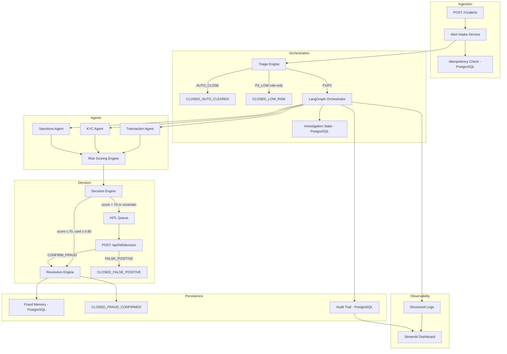
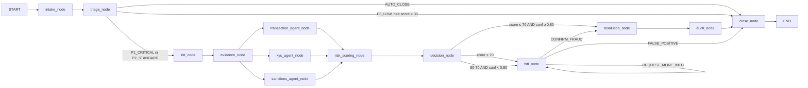
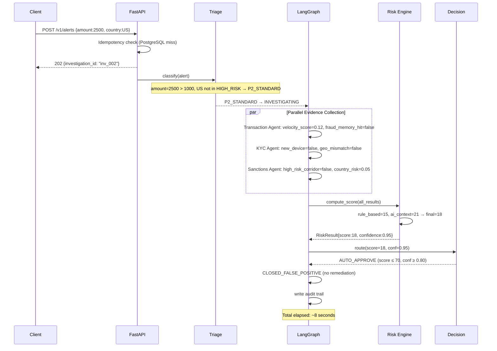
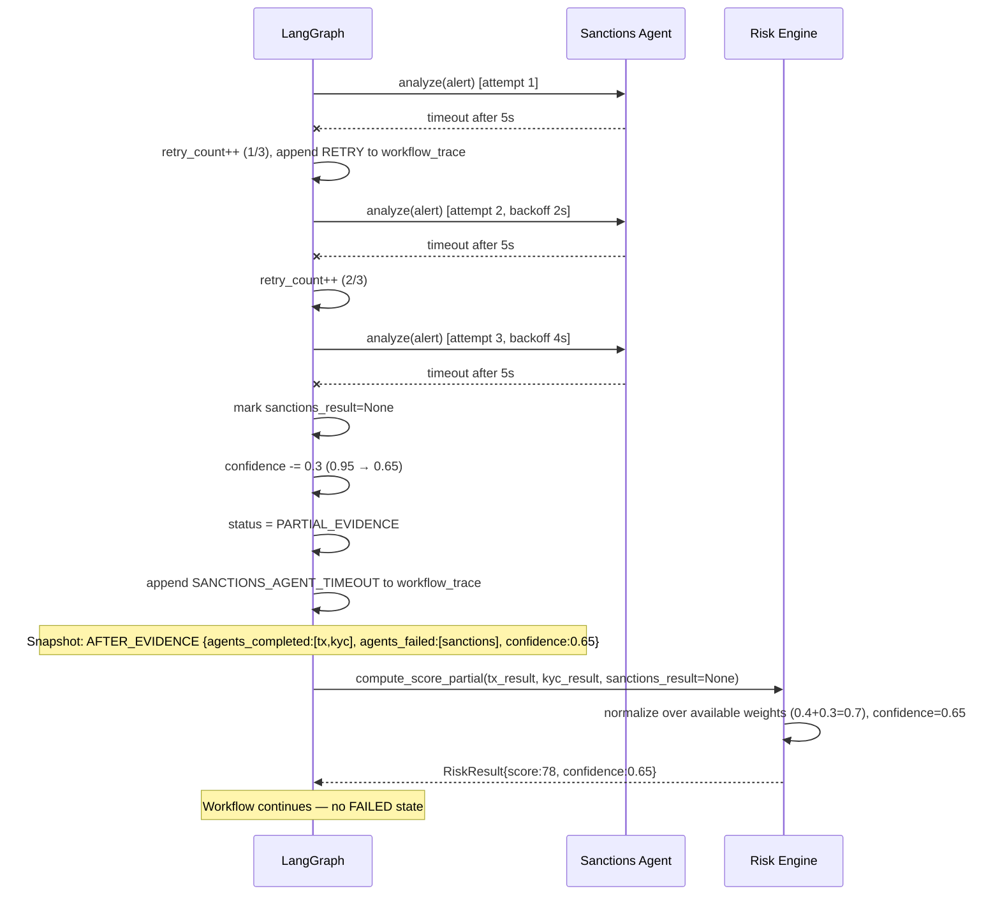

# Design Document: Agentic AI Fraud Investigator

## Overview

The Agentic AI Fraud Investigator is a demo-grade, production-oriented fraud operations platform for Andela Digital Bank. It automates the full fraud investigation lifecycle across ten stages using a LangGraph-orchestrated multi-agent workflow backed by FastAPI, PostgreSQL, and Claude (Sonnet + Haiku).

The core architectural principle is a hard separation between **deterministic control** (triage rules, state machine transitions, retry logic, policy routing) and **probabilistic AI reasoning** (contextual fraud analysis via Claude). AI agents operate within strict operational constraints and produce structured, schema-validated outputs. Every decision is auditable and explainable.

PostgreSQL serves as the single primary database for all persistence concerns: investigation state, agent outputs (stored as JSONB), audit logs, fraud memory, and idempotency keys. This simplifies the architecture, eliminates cross-service consistency issues, and makes local development straightforward.

### Demo Scenarios

**Scenario A — "The Midnight Mule"**: $2,500 offshore transfer at 2:15 AM from a student account. System flags P1_CRITICAL, runs parallel agents, scores 92/100, pauses for HITL, executes full remediation in under 4 minutes.

**Scenario B — "Legitimate Tuition Payment"**: $2,500 tuition payment to a known beneficiary. System auto-clears in under 10 seconds with risk score 18, no analyst involvement.

**Resilience Demo**: Sanctions Agent is intentionally timed out mid-demo. Workflow retries, reduces confidence 0.95 → 0.70, enters `PARTIAL_EVIDENCE` mode, and completes with partial evidence.

### Implementation Scope

- 3-day capstone implementation
- Single-bank simulation (Andela Digital Bank)
- All banking integrations are mocked (freeze, reverse, block, SMS)
- No real payment rails or external sanctions databases

---

## Architecture

### High-Level Component Diagram



### Technology Stack

| Layer | Technology |
|---|---|
| API | FastAPI (Python 3.11) |
| Orchestration | LangGraph |
| AI Models | Claude Sonnet 3.5 (complex reasoning), Claude Haiku 3 (risk scoring) |
| AI SDK | Anthropic Python SDK |
| Schema Validation | Pydantic v2 |
| Primary Database | PostgreSQL (all persistence: state, audit, fraud memory, idempotency) |
| Flexible Agent Data | PostgreSQL JSONB columns |
| Structured Logging | Python `logging` + JSON formatter (stdout / file) |
| Dashboard | Streamlit |
| Async Runtime | Python `asyncio` |
| DB Driver | `asyncpg` (async PostgreSQL) |
| Deployment | AWS Lambda (API) + ECS Fargate (Orchestrator) |

### Service Boundaries

```
┌─────────────────────────────────────────────────────────────┐
│  FastAPI Service (Lambda / ECS)                             │
│  - POST /v1/alerts               (Alert Intake)             │
│  - POST /api/hitl/{id}/decision  (HITL)                     │
│  - GET  /audit/{id}              (Audit Trail)              │
│  - GET  /investigations          (Dashboard feed)           │
└────────────────────┬────────────────────────────────────────┘
                     │ async task dispatch
┌────────────────────▼────────────────────────────────────────┐
│  LangGraph Orchestrator (ECS Fargate)                       │
│  - Manages Investigation state machine                      │
│  - Invokes agents via asyncio.gather                        │
│  - Checkpoints to PostgreSQL                                │
│  - Enforces asyncio.Semaphore(50) concurrency               │
└────────────────────┬────────────────────────────────────────┘
                     │
        ┌────────────┼────────────┐
        ▼            ▼            ▼
  Transaction     KYC Agent   Sanctions
    Agent                       Agent
  (Claude Haiku) (rule-based) (Claude Haiku)
                     │
              ┌──────▼──────┐
              │  PostgreSQL  │
              │  (single DB) │
              └─────────────┘
```


---

## Triage Engine Design

### Priority Tiers and Cost-Aware Routing

The Triage Engine classifies every alert before any AI agent is invoked. This is the primary cost-control mechanism — LLM calls only happen when the alert warrants it.

```
amount < 100                                    → AUTO_CLOSE       (no agents, no LLM)
amount > 1000 AND country in HIGH_RISK_LIST     → P1_CRITICAL      (all agents + LLM scoring)
amount 100–1000 OR country in MEDIUM_RISK_LIST  → P2_STANDARD      (all agents + LLM scoring)
amount 100–500, no risk signals                 → P3_LOW           (rule-only scoring, no LLM)
  └─ rule score < 30                            → CLOSED_LOW_RISK  (no LLM)
  └─ rule score ≥ 30                            → escalate to P2   (full investigation)
```

```python
HIGH_RISK_COUNTRIES = {"NG", "KP", "IR", "SY", "CU", "VE", "MM", "BY"}
MEDIUM_RISK_COUNTRIES = {"RU", "UA", "PK", "BD", "GH", "KE", "TZ"}

def classify(alert: AlertPayload) -> TriageResult:
    if alert.amount < 100:
        return TriageResult(priority="AUTO_CLOSE", route="CLOSED_AUTO_CLEARED")

    if alert.amount > 1000 and alert.recipient_country in HIGH_RISK_COUNTRIES:
        return TriageResult(priority="P1_CRITICAL", route="FULL_INVESTIGATION")

    if (100 <= alert.amount <= 1000) or alert.recipient_country in MEDIUM_RISK_COUNTRIES:
        return TriageResult(priority="P2_STANDARD", route="FULL_INVESTIGATION")

    if 100 <= alert.amount <= 500:
        rule_score = compute_rule_only_score(alert)
        if rule_score < 30:
            return TriageResult(priority="P3_LOW", route="CLOSED_LOW_RISK")
        return TriageResult(priority="P2_STANDARD", route="FULL_INVESTIGATION")

    return TriageResult(priority="P2_STANDARD", route="FULL_INVESTIGATION")
```

No LLM is invoked at any point in the Triage Engine. Classification completes within 50ms.

---

## LangGraph Graph Structure

### Node Definitions

| Node | Type | Description |
|---|---|---|
| `intake_node` | Sync | Validates payload, computes idempotency key, creates Investigation |
| `triage_node` | Sync | Applies deterministic triage rules, assigns P1/P2/P3/AUTO_CLOSE |
| `init_node` | Sync | Creates Investigation state object, checkpoints to PostgreSQL |
| `evidence_node` | Async (parallel) | Fans out to Transaction, KYC, Sanctions agents via `asyncio.gather` |
| `transaction_agent_node` | Async | Queries fraud memory, analyzes velocity and behavior |
| `kyc_agent_node` | Async | Checks device, geo, login anomalies |
| `sanctions_agent_node` | Async | Evaluates country risk, sanctions exposure |
| `risk_scoring_node` | Async | Computes hybrid rule-based + Claude Haiku risk score |
| `decision_node` | Sync | Policy routing based on score and confidence thresholds |
| `hitl_node` | Async (wait) | Checkpoints state, notifies analyst queue, waits for decision |
| `resolution_node` | Async | Executes mocked remediation actions in sequence |
| `audit_node` | Async | Writes final audit trail entry to PostgreSQL |
| `close_node` | Sync | Sets terminal Investigation status |

### Graph Edges and Conditional Routing



### Conditional Edge Logic

```python
def route_after_triage(state: InvestigationState) -> str:
    if state.triage_disposition in ("AUTO_CLOSE", "P3_LOW_CLOSED"):
        return "close_node"
    return "init_node"

def route_after_evidence(state: InvestigationState) -> str:
    # All agents failed → FAILED
    if all(r is None for r in [state.transaction_result, state.kyc_result, state.sanctions_result]):
        state.status = InvestigationStatus.FAILED
        return "close_node"
    # At least one agent succeeded → PARTIAL_EVIDENCE or SCORING
    if any(r is None for r in [state.transaction_result, state.kyc_result, state.sanctions_result]):
        state.status = InvestigationStatus.PARTIAL_EVIDENCE
    return "risk_scoring_node"

def route_after_decision(state: InvestigationState) -> str:
    score = state.risk_score
    conf = state.confidence
    if score <= 70 and conf >= 0.80:
        return "resolution_node"
    return "hitl_node"

def route_after_hitl(state: InvestigationState) -> str:
    decision = state.human_decision
    if decision == "CONFIRM_FRAUD":
        return "resolution_node"
    if decision == "FALSE_POSITIVE":
        return "close_node"
    return "hitl_node"  # REQUEST_MORE_INFO loops back
```


---

## Components and Interfaces

### API Endpoints

#### Alert Intake

```
POST /v1/alerts
Headers: X-API-Key: <key>
Body: AlertPayload
Response 202: { "investigation_id": "inv_...", "status": "RECEIVED" }
Response 200: { "investigation_id": "inv_...", "status": "<existing>" }  # duplicate
Response 401: { "error": "Unauthorized" }
Response 503: { "error": "Service unavailable", "retryable": true }
```

#### HITL Decision

```
POST /api/hitl/{investigation_id}/decision
Headers: X-API-Key: <key>, X-User-Role: Analyst
Body: { "decision": "CONFIRM_FRAUD" | "FALSE_POSITIVE" | "REQUEST_MORE_INFO", "analyst_id": "...", "notes": "..." }
Response 200: { "investigation_id": "...", "status": "RESOLUTION_IN_PROGRESS" | "CLOSED_FALSE_POSITIVE" | "AWAITING_HUMAN" }
Response 403: { "error": "Forbidden" }
Response 404: { "error": "Investigation not found" }
```

#### Audit Trail

```
GET /audit/{investigation_id}
Headers: X-API-Key: <key>, X-User-Role: Analyst | Auditor
Response 200: AuditTrailEntry
Response 403: { "error": "Forbidden" }
Response 404: { "error": "Not found" }
```

#### Investigation Status (Dashboard Feed)

```
GET /investigations?status=ACTIVE&limit=50
GET /investigations/{investigation_id}
Headers: X-API-Key: <key>
Response 200: InvestigationState
```

### Mocked Integration Endpoints

Internal FastAPI routes simulating banking system integrations:

```
POST /mock/freeze-account      Body: { "account_id": "..." }
POST /mock/reverse-transaction Body: { "transaction_id": "..." }
POST /mock/block-login         Body: { "account_id": "..." }
POST /mock/send-sms            Body: { "account_id": "...", "message": "..." }
```

Each mock returns `{ "success": true, "action": "<action_name>", "executed_at": "<timestamp>" }` after a simulated 50–200ms delay.

---

## Data Models

### AlertPayload

```python
class AlertPayload(BaseModel):
    transaction_id: str
    amount: float
    currency: str = "USD"
    timestamp: datetime
    account_id: str
    recipient_country: str
    alert_hash: str
    metadata: dict[str, Any] = {}
```

### InvestigationState (LangGraph State)

```python
class InvestigationState(TypedDict):
    # Identity
    investigation_id: str
    alert: AlertPayload

    # Lifecycle
    status: InvestigationStatus          # enum of all 13 states
    priority: Literal["P1_CRITICAL", "P2_STANDARD", "P3_LOW", "AUTO_CLOSE"]
    triage_disposition: str

    # Evidence (None if agent failed/timed out)
    transaction_result: TransactionResult | None
    kyc_result: KYCResult | None
    sanctions_result: SanctionsResult | None

    # Scoring
    risk_score: int                      # 0–100
    confidence: float                    # 0.0–1.0
    rule_based_score: int
    ai_context_score: int
    explanation: list[ExplanationEntry]

    # Decision
    decision_route: str | None           # "AUTO_APPROVE" | "HITL"
    human_decision: str | None           # "CONFIRM_FRAUD" | "FALSE_POSITIVE" | "REQUEST_MORE_INFO"
    analyst_id: str | None

    # Audit
    workflow_trace: list[WorkflowTraceEntry]
    retry_count: int
    created_at: datetime
    updated_at: datetime
```

### Agent Output Schemas

Pydantic v2 is used to enforce the structure of every agent output. If an agent returns a response that does not conform to the schema, the output is rejected and the Orchestrator applies a confidence reduction — the schema acts as a contract boundary between the AI layer and the deterministic control layer.

```python
class TransactionResult(BaseModel):
    velocity_score: float               # 0.0–1.0
    behavioral_anomaly: bool
    fraud_memory_hit: bool
    findings_summary: str
    raw_evidence: dict[str, Any] = {}

class KYCResult(BaseModel):
    new_device: bool
    geo_mismatch: bool
    login_anomaly: bool
    findings_summary: str

class SanctionsResult(BaseModel):
    high_risk_corridor: bool
    sanctions_hit: bool
    country_risk_score: float           # 0.0–1.0
    findings_summary: str

class RiskResult(BaseModel):
    risk_score: int                     # 0–100
    confidence: float                   # 0.0–1.0
    rule_based_score: int
    ai_context_score: int
    explanation: list[ExplanationEntry]

class ExplanationEntry(BaseModel):
    reason: str
    evidence_id: str                    # e.g. "transaction_agent_output"
    weight: float
```

### WorkflowTraceEntry

```python
class WorkflowTraceEntry(BaseModel):
    timestamp: datetime                 # millisecond precision
    event: str                          # e.g. "KYC_AGENT_COMPLETED"
    status: Literal["SUCCESS", "FAILURE", "TIMEOUT", "RETRY"]
    duration_ms: int | None
    detail: str | None = None
```

### State Evolution Snapshot

For demo visibility, the Orchestrator captures a lightweight snapshot of the Investigation state at each major stage. These snapshots are stored in the audit trail and rendered in the Streamlit dashboard as a stage-by-stage progression.

```python
class StateSnapshot(BaseModel):
    stage: str                          # e.g. "AFTER_TRIAGE", "AFTER_EVIDENCE", "AFTER_SCORING"
    timestamp: datetime
    status: str
    risk_score: int | None
    confidence: float | None
    agents_completed: list[str]         # e.g. ["transaction", "kyc"]
    agents_failed: list[str]            # e.g. ["sanctions"]
    decision_route: str | None
```

Snapshots are captured at: `AFTER_TRIAGE`, `AFTER_EVIDENCE`, `AFTER_SCORING`, `AFTER_DECISION`, `AFTER_RESOLUTION`.

---

## PostgreSQL Schema

PostgreSQL is the single primary database. JSONB columns store flexible AI agent outputs without requiring schema migrations when agent output structures evolve.

### Table: `investigations`

```sql
CREATE TABLE investigations (
    investigation_id    TEXT PRIMARY KEY,
    status              TEXT NOT NULL,
    priority            TEXT NOT NULL,
    risk_score          INTEGER,
    confidence          FLOAT,
    triage_disposition  TEXT,
    decision_route      TEXT,
    human_decision      TEXT,
    analyst_id          TEXT,
    retry_count         INTEGER DEFAULT 0,
    checkpoint_data     JSONB,          -- full serialized InvestigationState
    created_at          TIMESTAMPTZ NOT NULL DEFAULT NOW(),
    updated_at          TIMESTAMPTZ NOT NULL DEFAULT NOW()
);

CREATE INDEX idx_investigations_status ON investigations(status);
CREATE INDEX idx_investigations_created_at ON investigations(created_at);
```

### Table: `agent_outputs`

```sql
CREATE TABLE agent_outputs (
    id                  SERIAL PRIMARY KEY,
    investigation_id    TEXT NOT NULL REFERENCES investigations(investigation_id),
    agent_name          TEXT NOT NULL,   -- "transaction" | "kyc" | "sanctions" | "risk"
    output              JSONB,           -- TransactionResult, KYCResult, etc.
    status              TEXT NOT NULL,   -- "SUCCESS" | "TIMEOUT" | "SCHEMA_ERROR"
    duration_ms         INTEGER,
    created_at          TIMESTAMPTZ NOT NULL DEFAULT NOW()
);

CREATE INDEX idx_agent_outputs_investigation ON agent_outputs(investigation_id);
```

### Table: `audit_trail`

```sql
CREATE TABLE audit_trail (
    id                  SERIAL PRIMARY KEY,
    investigation_id    TEXT NOT NULL REFERENCES investigations(investigation_id),
    event_type          TEXT NOT NULL,
    event_data          JSONB NOT NULL,  -- full event payload
    created_at          TIMESTAMPTZ NOT NULL DEFAULT NOW()
);

-- Immutable: no UPDATE or DELETE permitted on this table
CREATE INDEX idx_audit_investigation ON audit_trail(investigation_id);
```

### Table: `fraud_memory`

```sql
CREATE TABLE fraud_memory (
    indicator_type      TEXT NOT NULL,   -- "account" | "device" | "ip"
    indicator_value     TEXT NOT NULL,
    investigation_id    TEXT NOT NULL,
    confirmed_at        TIMESTAMPTZ NOT NULL DEFAULT NOW(),
    expires_at          TIMESTAMPTZ NOT NULL,  -- confirmed_at + 365 days
    PRIMARY KEY (indicator_type, indicator_value)
);

CREATE INDEX idx_fraud_memory_expires ON fraud_memory(expires_at);
```

### Table: `idempotency_keys`

```sql
CREATE TABLE idempotency_keys (
    idempotency_key     TEXT PRIMARY KEY,
    investigation_id    TEXT NOT NULL,
    created_at          TIMESTAMPTZ NOT NULL DEFAULT NOW(),
    expires_at          TIMESTAMPTZ NOT NULL  -- created_at + 24 hours
);
```

### Table: `state_snapshots`

```sql
CREATE TABLE state_snapshots (
    id                  SERIAL PRIMARY KEY,
    investigation_id    TEXT NOT NULL REFERENCES investigations(investigation_id),
    stage               TEXT NOT NULL,
    snapshot_data       JSONB NOT NULL,  -- StateSnapshot
    created_at          TIMESTAMPTZ NOT NULL DEFAULT NOW()
);

CREATE INDEX idx_snapshots_investigation ON state_snapshots(investigation_id);
```


---

## Partial Investigation Mode

When one or more agents fail but at least one returns valid findings, the system enters `PARTIAL_EVIDENCE` mode rather than failing the investigation. This is a first-class operational mode, not an error state.

### Partial Evidence Behavior

| Agents Available | Mode | Confidence Impact | Outcome |
|---|---|---|---|
| All 3 succeed | Normal | None | Full scoring |
| 2 succeed, 1 timeout | PARTIAL_EVIDENCE | −0.30 | Scoring with 2 agents |
| 1 succeeds, 2 timeout | PARTIAL_EVIDENCE | −0.60 | Scoring with 1 agent |
| 0 succeed | FAILED | N/A | No scoring, terminal |

### Partial Evidence Scoring

When agent results are missing, the Risk Agent adjusts the rule-based score to use only available signals:

```python
def compute_rule_based_score_partial(
    tx: TransactionResult | None,
    kyc: KYCResult | None,
    san: SanctionsResult | None
) -> tuple[int, float]:
    """Returns (score, weight_sum) using only available signals."""
    score = 0.0
    weight_sum = 0.0

    if tx is not None:
        score += tx.velocity_score * 0.4
        weight_sum += 0.4

    if kyc is not None:
        score += float(kyc.new_device) * 0.3
        weight_sum += 0.3

    if san is not None:
        score += san.country_risk_score * 0.3
        weight_sum += 0.3

    # Normalize to full scale if partial
    normalized = (score / weight_sum * 100) if weight_sum > 0 else 0
    return round(normalized), weight_sum
```

The `PARTIAL_EVIDENCE` state is recorded in the `workflow_trace` and surfaced in the Streamlit dashboard with a visual indicator showing which agents contributed.

---

## Resolution Engine Design

The Resolution Engine is the action execution layer — it does not just notify, it executes operational changes against the banking system. Each action is independent: a failure in one does not block the others.

### Action Execution Flow

```python
async def execute_remediation(state: InvestigationState) -> list[ActionResult]:
    actions = [
        ("freeze_account",      "/mock/freeze-account",      {"account_id": state.alert.account_id}),
        ("reverse_transaction", "/mock/reverse-transaction",  {"transaction_id": state.alert.transaction_id}),
        ("block_login",         "/mock/block-login",          {"account_id": state.alert.account_id}),
        ("send_sms",            "/mock/send-sms",             {"account_id": state.alert.account_id,
                                                               "message": "Suspicious activity detected on your account."}),
    ]

    results = []
    for action_name, endpoint, payload in actions:
        try:
            response = await http_client.post(endpoint, json=payload)
            results.append(ActionResult(
                action=action_name,
                status="SUCCESS",
                executed_at=datetime.utcnow(),
                response=response.json()
            ))
        except Exception as e:
            results.append(ActionResult(
                action=action_name,
                status="FAILURE",
                executed_at=datetime.utcnow(),
                error=str(e)
            ))
            # Log failure, continue to next action
            await audit.append_event(state.investigation_id, "ACTION_FAILED", {"action": action_name, "error": str(e)})

    return results
```

### ActionResult Model

```python
class ActionResult(BaseModel):
    action: str
    status: Literal["SUCCESS", "FAILURE", "SKIPPED"]
    executed_at: datetime
    response: dict | None = None
    error: str | None = None
```

All `ActionResult` entries are written to the audit trail and displayed in the Streamlit dashboard per-action.

---

## Sequence Diagrams

### Scenario A: "The Midnight Mule" (Fraud Confirmed via HITL)

```mermaid
sequenceDiagram
    participant Client
    participant API as FastAPI
    participant Triage
    participant LG as LangGraph
    participant TxAgent as Transaction Agent
    participant KYCAgent as KYC Agent
    participant SanAgent as Sanctions Agent
    participant Risk as Risk Engine
    participant Decision
    participant Analyst
    participant Resolution

    Client->>API: POST /v1/alerts {amount:2500, country:NG}
    API->>API: Idempotency check (PostgreSQL miss)
    API-->>Client: 202 {investigation_id: "inv_001"}
    API->>Triage: classify(alert)
    Note over Triage: amount=2500 > 1000, NG in HIGH_RISK → P1_CRITICAL
    Triage-->>LG: P1_CRITICAL → INVESTIGATING
    LG->>LG: init_node: create state, checkpoint PostgreSQL
    Note over LG: Snapshot: AFTER_TRIAGE {status:INVESTIGATING, priority:P1_CRITICAL}

    par Parallel Evidence Collection
        LG->>TxAgent: analyze(alert, fraud_memory)
        LG->>KYCAgent: analyze(alert)
        LG->>SanAgent: analyze(alert)
    end

    TxAgent-->>LG: velocity_score=0.98, fraud_memory_hit=false
    KYCAgent-->>LG: new_device=true, geo_mismatch=true
    SanAgent-->>LG: high_risk_corridor=true, country_risk=0.85
    Note over LG: Snapshot: AFTER_EVIDENCE {agents_completed:[tx,kyc,san], confidence:1.0}

    LG->>Risk: compute_score(all_results)
    Risk->>Risk: rule_based=91, ai_context=93 → final=92
    Risk-->>LG: RiskResult{score:92, confidence:0.95}
    Note over LG: Snapshot: AFTER_SCORING {risk_score:92, confidence:0.95}

    LG->>Decision: route(score=92, conf=0.95)
    Decision-->>LG: HITL (score > 70)
    Note over LG: Snapshot: AFTER_DECISION {decision_route:HITL}
    LG->>LG: checkpoint AWAITING_HUMAN → PostgreSQL

    LG-->>Analyst: notify queue: inv_001 awaiting review
    Analyst->>API: POST /api/hitl/inv_001/decision {CONFIRM_FRAUD}
    API->>LG: resume(CONFIRM_FRAUD)

    LG->>Resolution: execute_remediation()
    Resolution->>Resolution: freeze_account → reverse_tx → block_login → send_sms
    Note over Resolution: Each action logged independently; failures don't halt workflow
    Resolution->>LG: update fraud_memory (PostgreSQL)
    LG->>LG: CLOSED_FRAUD_CONFIRMED
    Note over LG: Snapshot: AFTER_RESOLUTION {status:CLOSED_FRAUD_CONFIRMED}
    LG->>LG: write audit trail
```

### Scenario B: "Legitimate Tuition Payment" (Auto-Clear)



### Resilience Demo: Sanctions Agent Timeout + Partial Evidence Mode



---

## Failure Handling Design

### Agent Failure Policy

| Failure Type | Action | Confidence Impact | State |
|---|---|---|---|
| Agent timeout (single attempt) | Retry with exponential backoff | None yet | — |
| Agent timeout (all 3 retries exhausted) | Mark result as `None`, continue | −0.30 | `PARTIAL_EVIDENCE` |
| Pydantic schema validation failure | Reject output, treat as no findings | −0.20 | `PARTIAL_EVIDENCE` |
| All 3 agents fail | Transition to `FAILED` | N/A | `FAILED` |
| At least 1 agent returns valid findings | Continue to scoring | Accumulated reductions | `PARTIAL_EVIDENCE` → `SCORING` |

### Exponential Backoff

```python
RETRY_CONFIG = {
    "max_attempts": 3,
    "base_delay_seconds": 2,
    "multiplier": 2,
    # delays: 2s, 4s, 8s
}
```

### Confidence Reduction Accumulation

```python
initial_confidence = 1.0
# Each timed-out agent: -0.30
# Each schema validation failure: -0.20
# Floor: 0.10
final_confidence = max(0.10, initial_confidence - accumulated_reductions)
```

### PostgreSQL Connectivity Failure

- Alert Intake: returns HTTP 503 with `"retryable": true`
- Orchestrator checkpoint failure: logs error, retries checkpoint up to 3 times before transitioning to `FAILED`

---

## Checkpoint and Recovery Design

### Checkpoint Points

The Orchestrator writes a full serialized `InvestigationState` to the `investigations.checkpoint_data` JSONB column at:

1. After `init_node` — before any agent runs
2. After `evidence_node` — after all parallel agents finish or time out
3. After `risk_scoring_node` — after score is computed
4. After `decision_node` — after routing decision is recorded
5. On entry to `hitl_node` — before pausing for human input
6. After each `resolution_node` action — after each remediation step

### Recovery on Restart

```python
async def resume_on_startup():
    # Query all non-terminal investigations
    rows = await db.fetch(
        "SELECT investigation_id, checkpoint_data FROM investigations "
        "WHERE status NOT IN ('CLOSED_FRAUD_CONFIRMED','CLOSED_FALSE_POSITIVE',"
        "'CLOSED_AUTO_CLEARED','CLOSED_LOW_RISK','FAILED')"
    )
    for row in rows:
        state = InvestigationState(**row["checkpoint_data"])
        await orchestrator.resume(state)
```

---

## Decision Engine Routing Logic

```python
def route_investigation(risk_score: int, confidence: float) -> DecisionRoute:
    """Deterministic policy routing. No AI involvement. All thresholds are constants."""
    if risk_score <= 70 and confidence >= 0.80:
        return DecisionRoute.AUTO_APPROVE
    elif risk_score > 70:
        return DecisionRoute.HITL
    elif 50 <= risk_score <= 70 and confidence < 0.80:
        return DecisionRoute.HITL
    else:
        # risk_score < 50 and confidence < 0.80 — low risk but uncertain
        return DecisionRoute.AUTO_APPROVE

THRESHOLDS = {
    "auto_approve_max_score": 70,
    "auto_approve_min_confidence": 0.80,
    "hitl_min_score": 70,
    "uncertainty_score_range": (50, 70),
    "uncertainty_confidence_threshold": 0.80,
}
```

---

## Analyst Role Enforcement

```python
def require_role(*allowed_roles: str):
    async def dependency(x_user_role: str = Header(...)):
        if x_user_role not in allowed_roles:
            raise HTTPException(status_code=403, detail="Forbidden")
        return x_user_role
    return dependency

@app.post("/api/hitl/{investigation_id}/decision",
          dependencies=[Depends(require_role("Analyst"))])

@app.get("/audit/{investigation_id}",
         dependencies=[Depends(require_role("Analyst", "Auditor"))])
```

| Endpoint | Analyst | Auditor |
|---|---|---|
| `POST /api/hitl/{id}/decision` | ✅ | ❌ |
| `GET /audit/{id}` | ✅ | ✅ |
| `GET /investigations` | ✅ | ✅ |
| `GET /investigations/{id}` | ✅ | ✅ |

---

## Error Handling

### HTTP Error Envelope

```json
{
  "error": "Human-readable message",
  "code": "MACHINE_READABLE_CODE",
  "retryable": false,
  "investigation_id": "inv_..."
}
```

### Error Taxonomy

| Scenario | HTTP Status | `retryable` | Action |
|---|---|---|---|
| Missing/invalid API key | 401 | false | Reject |
| Unauthorized role | 403 | false | Reject |
| Investigation not found | 404 | false | Reject |
| Duplicate alert | 200 | — | Return existing status |
| PostgreSQL unavailable | 503 | true | Return error, do not create investigation |
| Invalid payload schema | 422 | false | Return validation errors |
| Agent timeout (all retries) | — | — | Internal: reduce confidence, PARTIAL_EVIDENCE |
| All agents fail | — | — | Internal: transition to FAILED |
| Unrecoverable orchestrator error | — | — | Internal: transition to FAILED, log |

### HITL Timeout Handling

If no analyst decision is received within 30 minutes:
1. Background job queries `AWAITING_HUMAN` investigations older than 30 minutes
2. Logs `HITL_TIMEOUT` to `workflow_trace` and `audit_trail`
3. Re-notifies analyst queue (log entry)
4. Investigation remains in `AWAITING_HUMAN`


---

## Correctness Properties

*A property is a characteristic or behavior that should hold true across all valid executions of a system.*

### Property 1: Idempotency Key Determinism
*For any* `transaction_id` and `alert_hash`, computing the idempotency key twice must produce the same result equal to `sha256(transaction_id + alert_hash)`.
**Validates: Requirements 1.3**

### Property 2: Duplicate Alert Deduplication
*For any* valid alert submitted twice, the second submission must return HTTP 200 with the same `investigation_id` and no new Investigation created in PostgreSQL.
**Validates: Requirements 1.4**

### Property 3: Valid Alert Intake Response
*For any* valid, non-duplicate alert with a valid API key, the Alert_Intake must return HTTP 202 with a non-empty `investigation_id` and transition to `RECEIVED` within 500ms.
**Validates: Requirements 1.5**

### Property 4: Triage Routing Correctness
*For any* alert, the Triage_Engine must assign exactly one priority (AUTO_CLOSE, P1_CRITICAL, P2_STANDARD, or P3_LOW) deterministically. No alert may fall through without a disposition.
**Validates: Requirements 2.1–2.4**

### Property 5: Triage LLM Exclusion
*For any* alert, the Triage_Engine must complete classification without invoking any LLM call. Classification time must be ≤ 50ms.
**Validates: Requirements 2.5**

### Property 6: Investigation State Initialization Completeness
*For any* alert that passes triage with P1/P2 priority, the resulting `InvestigationState` must contain all required fields with no absent or `None` required values at initialization.
**Validates: Requirements 3.1**

### Property 7: Checkpoint Recovery Round-Trip
*For any* Investigation in a non-terminal state, serializing to PostgreSQL and deserializing must produce an equivalent state. A new Orchestrator resuming from that checkpoint must continue from the same node without data loss.
**Validates: Requirements 3.3**

### Property 8: Concurrency Limit Enforcement
*For any* burst of concurrent alert submissions, the number of simultaneously executing Investigations must never exceed 50. Excess investigations must queue rather than fail.
**Validates: Requirements 3.4**

### Property 9: Agent Retry Policy
*For any* consistently failing agent, the Orchestrator must invoke it exactly 3 times with exponential backoff before marking it timed out. The agent must not be invoked a 4th time.
**Validates: Requirements 4.2**

### Property 10: Confidence Reduction Accumulation
*For any* Investigation with agent failures, `final_confidence == max(0.10, 1.0 - timeouts×0.30 - schema_failures×0.20)`. Confidence must never fall below 0.10.
**Validates: Requirements 4.3, 4.4**

### Property 11: Partial Evidence Mode Activation
*For any* Investigation where 1–2 agents fail but at least one succeeds, the Investigation must enter `PARTIAL_EVIDENCE` state and proceed to `SCORING`. It must not transition to `FAILED`.
**Validates: Requirements 4.3, 13.7**

### Property 12: All-Agent Failure Leads to FAILED
*For any* Investigation where all three agents fail, the Investigation must transition to `FAILED` and no scoring or remediation must occur.
**Validates: Requirements 4.9**

### Property 13: Agent Output Schema Conformance
*For any* alert processed by an agent, the returned output must be a valid instance of the corresponding Pydantic model with all required fields present and correctly typed.
**Validates: Requirements 4.5, 4.6, 4.7**

### Property 14: Post-Evidence Transition
*For any* Investigation, after all parallel agents complete or time out, the Investigation must transition to either `SCORING` (via `PARTIAL_EVIDENCE` if applicable) or `FAILED`. It must never stall in `INVESTIGATING`.
**Validates: Requirements 4.8**

### Property 15: Risk Score Formula Correctness
*For any* combination of agent signals, the rule-based score must equal `round((velocity×0.4 + new_device×0.3 + high_risk_country×0.3) × 100)`. The final score must equal `round((rule_based×0.5) + (ai_context×0.5))`.
**Validates: Requirements 5.1, 5.3**

### Property 16: Partial Evidence Score Normalization
*For any* partial evidence set, the rule-based score must be normalized over the sum of available signal weights, not the full weight sum of 1.0.
**Validates: Partial Investigation Mode design**

### Property 17: Confidence Floor Application
*For any* `RiskResult`, `confidence` must never be less than 0.10 regardless of how many agents failed.
**Validates: Requirements 5.4**

### Property 18: Risk Explanation Structure
*For any* `RiskResult`, every `ExplanationEntry` must have a non-empty `reason` and a non-empty `evidence_id` referencing a valid agent output source.
**Validates: Requirements 5.6**

### Property 19: Decision Engine Routing Correctness
*For any* `(risk_score, confidence)` pair, the Decision Engine must produce exactly one deterministic route with no undefined cases.
**Validates: Requirements 6.1, 6.2, 6.3**

### Property 20: Decision Routing Recorded in Audit Trail
*For any* Investigation passing through the Decision Engine, the Audit_Trail must contain the `decision_route` and threshold values applied.
**Validates: Requirements 6.4**

### Property 21: HITL Safety Invariant
*For any* Investigation in `AWAITING_HUMAN`, the Resolution_Engine must not be invoked and no mock banking endpoints may be called.
**Validates: Requirements 7.2**

### Property 22: HITL Decision State Transitions
*For any* Investigation in `AWAITING_HUMAN`, each decision must produce exactly the correct state transition: `CONFIRM_FRAUD` → `RESOLUTION_IN_PROGRESS`, `FALSE_POSITIVE` → `CLOSED_FALSE_POSITIVE`, `REQUEST_MORE_INFO` → remains `AWAITING_HUMAN`.
**Validates: Requirements 7.4, 7.5, 7.6**

### Property 23: Role-Based Access Control Enforcement
*For any* request to a protected endpoint, HTTP 403 must be returned for any role not in the allowed set, and HTTP 401 for a missing API key.
**Validates: Requirements 1.2, 7.8, 9.6, 12.4**

### Property 24: Resolution Engine Ordering and Resilience
*For any* Investigation entering `RESOLUTION_IN_PROGRESS`, all four actions must be attempted in order (freeze → reverse → block → SMS). A single action failure must not halt the remaining actions.
**Validates: Requirements 8.1, 8.3**

### Property 25: Fraud Memory Integrity
*For any* `CLOSED_FRAUD_CONFIRMED` Investigation, all confirmed indicators must be stored in PostgreSQL with `expires_at = confirmed_at + 365 days`. Querying by `(indicator_type, indicator_value)` must return the stored indicator.
**Validates: Requirements 8.5, 11.1, 11.2, 11.4**

### Property 26: Audit Trail Completeness
*For any* completed Investigation, the Audit_Trail must contain at least one entry per event category: state transitions, agent invocations, Decision_Engine routing, and Resolution_Engine actions. Every `WorkflowTraceEntry` must conform to schema with millisecond-precision timestamps.
**Validates: Requirements 9.1, 9.2**

### Property 27: Audit Trail Immutability
*For any* audit trail entry written to PostgreSQL, no UPDATE or DELETE operation may be issued against the `audit_trail` table after the entry is created.
**Validates: Requirements 9.5**

### Property 28: State Snapshot Completeness
*For any* Investigation that reaches `CLOSED_FRAUD_CONFIRMED` or `CLOSED_FALSE_POSITIVE`, snapshots must exist for all five stages: `AFTER_TRIAGE`, `AFTER_EVIDENCE`, `AFTER_SCORING`, `AFTER_DECISION`, `AFTER_RESOLUTION`.
**Validates: State Evolution Snapshot design**

### Property 29: CloudWatch Log Structure
*For any* Investigation lifecycle event, the structured log entry must contain all required fields: `investigation_id`, `status`, `risk_score`, `confidence`, `retry_count`, `investigation_duration_ms`.
**Validates: Requirements 10.1**

### Property 30: Partial Evidence Resilience (End-to-End)
*For any* Investigation where 1–2 agents fail but at least one succeeds, the Investigation must reach a terminal state (`CLOSED_FRAUD_CONFIRMED`, `CLOSED_FALSE_POSITIVE`, or `CLOSED_AUTO_CLEARED`). `FAILED` is only permitted when all three agents fail.
**Validates: Requirements 13.7**

---

## Testing Strategy

### Dual Testing Approach

- **Unit tests**: verify specific examples, integration points, and edge cases
- **Property tests**: verify universal invariants across randomized inputs using [Hypothesis](https://hypothesis.readthedocs.io/)

```bash
pip install hypothesis pytest pytest-asyncio asyncpg
```

### Property Test Configuration

```python
# conftest.py
from hypothesis import settings, HealthCheck
settings.register_profile("ci", max_examples=100, suppress_health_check=[HealthCheck.too_slow])
settings.register_profile("dev", max_examples=50)
settings.load_profile("ci")
```

### Tag Convention

```python
# Feature: agentic-fraud-investigator, Property 4: Triage Routing Correctness
@given(amount=st.floats(min_value=0, max_value=99.99))
def test_triage_auto_close(amount):
    ...
```

### Property Test Coverage Map

| Property | Test File | Hypothesis Strategy |
|---|---|---|
| P1: Idempotency key determinism | `test_intake.py` | `st.text()` |
| P2: Duplicate deduplication | `test_intake.py` | `st.builds(AlertPayload)` |
| P3: Valid alert intake | `test_intake.py` | `st.builds(AlertPayload)` |
| P4: Triage routing | `test_triage.py` | `st.floats()`, `st.sampled_from(countries)` |
| P5: Triage LLM exclusion | `test_triage.py` | `st.builds(AlertPayload)` |
| P6: State initialization | `test_orchestrator.py` | `st.builds(AlertPayload)` |
| P7: Checkpoint recovery | `test_orchestrator.py` | `st.builds(InvestigationState)` |
| P8: Concurrency limit | `test_orchestrator.py` | `st.integers(51, 200)` |
| P9: Agent retry policy | `test_agents.py` | `st.just(always_failing_agent)` |
| P10: Confidence reduction | `test_agents.py` | `st.integers(0, 3)` for failure counts |
| P11: Partial evidence mode | `test_orchestrator.py` | `st.integers(1, 2)` for failure count |
| P12: All-agent failure | `test_orchestrator.py` | `st.just(3)` failures |
| P13: Agent schema conformance | `test_agents.py` | `st.builds(AlertPayload)` |
| P14: Post-evidence transition | `test_orchestrator.py` | `st.builds(AlertPayload)` |
| P15: Risk score formula | `test_risk.py` | `st.floats(0, 1)` |
| P16: Partial score normalization | `test_risk.py` | `st.integers(1, 2)` for available agents |
| P17: Confidence floor | `test_risk.py` | `st.floats(0, 3)` for reductions |
| P18: Explanation structure | `test_risk.py` | `st.builds(RiskResult)` |
| P19: Decision routing | `test_decision.py` | `st.integers(0, 100)`, `st.floats(0, 1)` |
| P20: Decision in audit trail | `test_decision.py` | `st.builds(InvestigationState)` |
| P21: HITL safety invariant | `test_hitl.py` | `st.builds(InvestigationState)` |
| P22: HITL transitions | `test_hitl.py` | `st.sampled_from(decisions)` |
| P23: RBAC enforcement | `test_auth.py` | `st.text()` for role values |
| P24: Resolution ordering | `test_resolution.py` | `st.builds(InvestigationState)` |
| P25: Fraud memory integrity | `test_fraud_memory.py` | `st.builds(FraudMemoryItem)` |
| P26: Audit completeness | `test_audit.py` | `st.builds(InvestigationState)` |
| P27: Audit immutability | `test_audit.py` | `st.builds(InvestigationState)` |
| P28: Snapshot completeness | `test_audit.py` | `st.builds(InvestigationState)` |
| P29: Log structure | `test_observability.py` | `st.builds(InvestigationState)` |
| P30: Partial evidence resilience | `test_orchestrator.py` | `st.integers(0, 2)` |

### Key Edge Cases for Unit Tests

- `amount = 99.99` → AUTO_CLOSE; `amount = 100.00` → not AUTO_CLOSE
- `amount = 1000.01`, `country = "NG"` → P1_CRITICAL
- `amount = 300`, `country = "US"` → P3_LOW rule-only path
- All three agents time out → `FAILED`
- Two agents time out → `PARTIAL_EVIDENCE`, confidence = `max(0.10, 1.0 - 0.60)` = 0.40
- `risk_score = 70` exactly → AUTO_APPROVE (boundary)
- `risk_score = 71` exactly → HITL (boundary)
- `confidence = 0.80` exactly → AUTO_APPROVE (boundary)
- `confidence = 0.79`, `risk_score = 65` → HITL (uncertainty branch)
- HITL timeout at exactly 30 minutes
- Duplicate alert submitted within 1ms of original
- Audit trail GET for non-existent `investigation_id`
- Resolution action 2 fails; actions 1, 3, 4 must still execute
