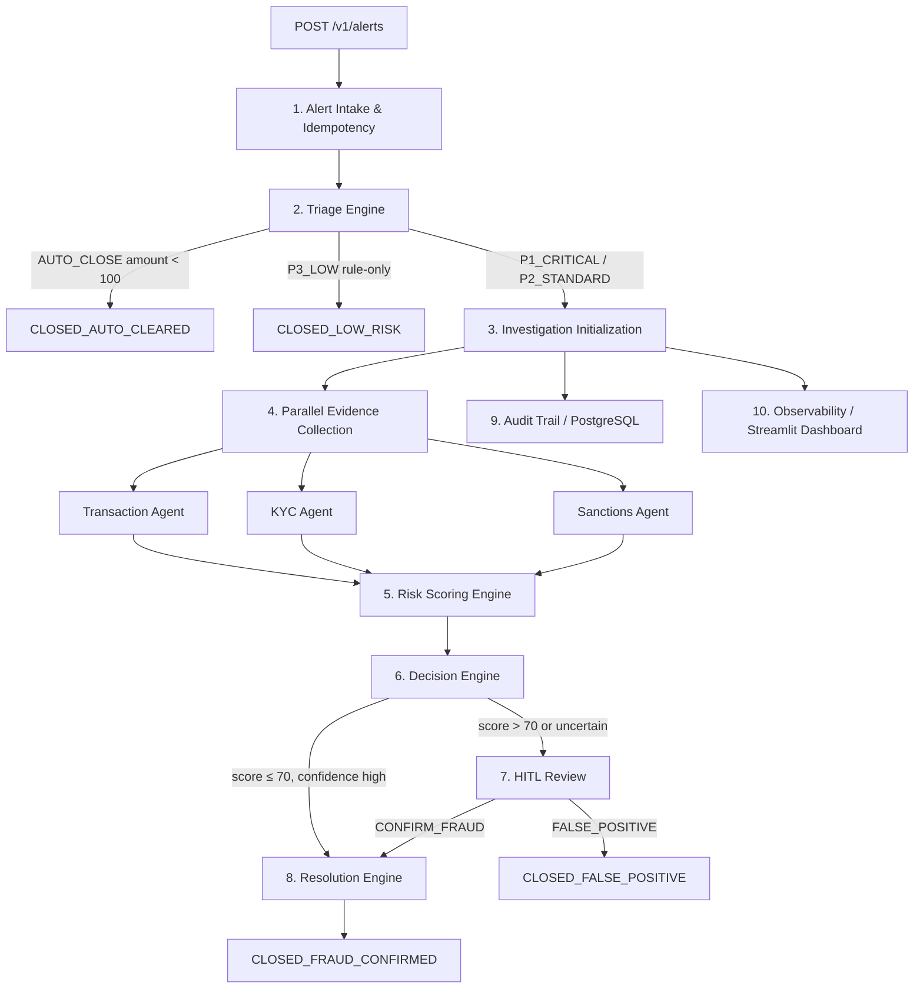

# Requirements Document

## Introduction

The Agentic AI Fraud Investigator is a production-oriented fraud operations platform for Andela Digital Bank. It automates the full fraud investigation lifecycle across ten well-defined stages: alert intake, triage, investigation initialization, parallel evidence collection, risk scoring, decision routing, human review, resolution, audit, and observability.

The system separates deterministic business controls (triage rules, schema validation, retries, state management) from probabilistic AI reasoning (contextual fraud analysis via Claude). This boundary ensures AI operates within strict operational constraints while delivering explainable, evidence-grounded decisions.

Designed as a capstone demo for the Andela AI Engineering Bootcamp, the platform targets a 3-day implementation timeline.

### Demo Scenarios

**Scenario A — "The Midnight Mule" (Fraud Case)**
A $2,500 offshore transfer at 2:15 AM from a student account with a $20/day historical average. The system flags it P1_CRITICAL, runs parallel agents, scores risk at 92/100, pauses for human approval, and executes full remediation in under 4 minutes.

**Scenario B — "Legitimate Tuition Payment" (False Positive Prevention)**
A $2,500 student tuition payment to a known beneficiary from the same device and location. The system auto-clears it in under 10 seconds with risk score 18 and no analyst involvement. This demonstrates precision and false-positive reduction — equally important to fraud detection.

**Demo Failure Injection (Resilience Showcase)**
The Sanctions Agent is intentionally timed out mid-demo. The workflow retries, reduces confidence from 0.95 → 0.70, and completes using partial evidence. This demonstrates graceful degradation rather than catastrophic failure.

---

## Glossary

- **System**: The Agentic AI Fraud Investigator platform as a whole.
- **Alert_Intake**: The FastAPI webhook endpoint that receives fraud alerts.
- **Triage_Engine**: The deterministic rules engine that classifies alerts before AI orchestration.
- **Orchestrator**: The LangGraph workflow engine managing agent execution, state, retries, checkpoints, and human pauses.
- **Transaction_Agent**: Analyzes transaction velocity, behavioral history, and fraud memory.
- **KYC_Agent**: Detects device anomalies, geo-location mismatches, and login anomalies.
- **Sanctions_Agent**: Evaluates geo risk, high-risk corridors, and sanctions exposure.
- **Risk_Agent**: Produces the final hybrid risk score and explainable reasoning.
- **Decision_Engine**: The policy layer that routes investigations to auto-approve, HITL, or escalation based on score and confidence.
- **Risk_Score**: An integer 0–100 representing fraud probability.
- **Confidence**: A float 0.0–1.0 representing the reliability of the Risk_Score given available evidence.
- **Fraud_Memory**: PostgreSQL table storing confirmed fraud indicators (accounts, device fingerprints, IPs).
- **HITL**: Human-in-the-Loop review triggered by the Decision_Engine for high-risk or uncertain investigations.
- **Resolution_Engine**: The action execution layer that applies remediation operations after a confirmed fraud decision.
- **Audit_Trail**: Immutable per-investigation record of all events, decisions, and agent outputs stored in PostgreSQL.
- **Workflow_Trace**: Structured timestamped log of every agent event within an Investigation, embedded in the Audit_Trail.
- **Investigation**: A stateful workflow instance tracking one fraud alert from intake to closure.
- **P1_CRITICAL**: Highest alert priority — high-amount transfer to a high-risk country. Routed immediately to full AI investigation.
- **P2_STANDARD**: Medium alert priority — moderate-risk signals. Routed to full AI investigation.
- **P3_LOW**: Low alert priority — low-risk signals not meeting AUTO_CLOSE threshold. Routed to lightweight rule-only scoring without LLM calls.
- **AUTO_CLOSE**: Triage disposition for minimal-risk alerts resolved without any AI involvement.
- **Partial_Investigation**: Investigation mode where one or more agents failed but at least one returned valid findings; workflow continues with reduced confidence.

---

## Investigation Lifecycle

Every Investigation follows a defined state machine. States are persisted to PostgreSQL at each transition.

```
RECEIVED → TRIAGE → INVESTIGATING → SCORING → DECIDING → AWAITING_HUMAN → RESOLUTION_IN_PROGRESS → CLOSED_FRAUD_CONFIRMED
                                                        ↘ RESOLUTION_IN_PROGRESS (auto-approve)
                                                                         ↘ CLOSED_FALSE_POSITIVE
                  ↘ CLOSED_AUTO_CLEARED (from TRIAGE, amount < 100)
                  ↘ CLOSED_LOW_RISK (from TRIAGE, P3_LOW rule-only path)
                         ↘ PARTIAL_EVIDENCE (agent failures, workflow continues with reduced confidence)
                                                                                                  ↘ FAILED
```

| State                    | Description                                                                      |
|--------------------------|----------------------------------------------------------------------------------|
| `RECEIVED`               | Alert accepted; idempotency check passed.                                        |
| `TRIAGE`                 | Triage_Engine is classifying the alert into P1/P2/P3/AUTO_CLOSE.                |
| `INVESTIGATING`          | Parallel agents (Transaction, KYC, Sanctions) are executing.                     |
| `PARTIAL_EVIDENCE`       | One or more agents failed; workflow continues with available evidence.           |
| `SCORING`                | Risk_Agent is computing the hybrid risk score.                                   |
| `DECIDING`               | Decision_Engine is routing the investigation based on score and confidence.      |
| `AWAITING_HUMAN`         | Workflow paused; analyst decision required.                                      |
| `RESOLUTION_IN_PROGRESS` | Resolution_Engine is executing remediation actions.                              |
| `CLOSED_FRAUD_CONFIRMED` | Fraud confirmed; all remediation actions executed.                               |
| `CLOSED_FALSE_POSITIVE`  | Analyst determined no fraud; no action taken.                                    |
| `CLOSED_AUTO_CLEARED`    | Closed by triage (amount < 100) without AI involvement.                          |
| `CLOSED_LOW_RISK`        | Closed by triage P3 rule-only path; no LLM invoked.                             |
| `FAILED`                 | Unrecoverable error — all agents failed or unhandled exception.                  |

---

## System Architecture Overview



---

## Requirements

### Requirement 1: Alert Intake and Idempotency

**User Story:** As a fraud operations system, I want to receive and deduplicate incoming fraud alerts via a secure API, so that each alert is processed exactly once regardless of retries or duplicate submissions.

#### Acceptance Criteria

1. THE Alert_Intake SHALL expose a `POST /v1/alerts` endpoint accepting a JSON payload containing at minimum: `transaction_id`, `amount`, `currency`, `timestamp`, `account_id`, `recipient_country`, and `alert_hash`.
2. WHEN a request is received, THE Alert_Intake SHALL reject requests missing a valid `X-API-Key` header with HTTP 401.
3. THE Alert_Intake SHALL compute an idempotency key as `sha256(transaction_id + alert_hash)` and store it in PostgreSQL on first receipt.
4. WHEN a duplicate alert is received with an idempotency key already present in PostgreSQL, THE Alert_Intake SHALL return HTTP 200 with the existing investigation status without creating a new Investigation.
5. WHEN a valid, non-duplicate alert is received, THE Alert_Intake SHALL return HTTP 202 with an `investigation_id` and transition the Investigation to `RECEIVED` within 500ms.
6. IF the PostgreSQL idempotency check fails due to a connectivity error, THEN THE Alert_Intake SHALL return HTTP 503 with a retryable error response.

---

### Requirement 2: Triage Engine

**User Story:** As a fraud operations system, I want to classify alerts into priority tiers using deterministic rules before invoking AI agents, so that LLM costs are minimized and each alert receives the appropriate level of investigation.

#### Acceptance Criteria

1. WHEN an alert is received with `amount < 100`, THE Triage_Engine SHALL assign disposition `AUTO_CLOSE`, transition the Investigation to `CLOSED_AUTO_CLEARED`, and resolve it without invoking any agent or LLM.
2. WHEN an alert is received with `amount > 1000` AND `recipient_country` is in the high-risk country list, THE Triage_Engine SHALL assign priority `P1_CRITICAL` and route to full AI investigation (all three agents + LLM scoring).
3. WHEN an alert is received with `amount` between 100–1000 OR `recipient_country` is in a medium-risk country list, THE Triage_Engine SHALL assign priority `P2_STANDARD` and route to full AI investigation.
4. WHEN an alert does not match P1 or P2 criteria and `amount` is between 100–500 with no risk signals, THE Triage_Engine SHALL assign priority `P3_LOW`, apply rule-only scoring without invoking any LLM, and transition to `CLOSED_LOW_RISK` if the rule score is below 30.
5. THE Triage_Engine SHALL complete classification within 50ms without invoking any LLM.
6. THE Triage_Engine SHALL record the assigned priority and routing decision in the Investigation state before passing to the Orchestrator.

---

### Requirement 3: Investigation Initialization

**User Story:** As a fraud operations system, I want each investigation to be initialized with a persisted state object before any agent runs, so that the workflow is recoverable from any point of failure.

#### Acceptance Criteria

1. WHEN an alert passes triage with P1 or P2 priority, THE Orchestrator SHALL create an Investigation state object containing: `investigation_id`, `status`, `priority`, `risk_score`, `confidence`, `findings`, `workflow_trace`, `retry_count`, and `human_decision`.
2. THE Orchestrator SHALL persist the initial state to PostgreSQL before invoking any agent.
3. IF the Orchestrator service restarts while an Investigation is in any non-terminal state, THEN THE Orchestrator SHALL reload the latest checkpoint from PostgreSQL and resume from that state without data loss.
4. THE Orchestrator SHALL enforce a maximum concurrency of 50 simultaneous Investigations per instance using `asyncio.Semaphore(50)`.

---

### Requirement 4: Parallel Evidence Collection

**User Story:** As a fraud investigator, I want three specialized agents to run simultaneously and collect evidence across behavioral, device, and geo/sanctions dimensions, so that investigation time is minimized and coverage is comprehensive.

#### Acceptance Criteria

1. THE Orchestrator SHALL invoke the Transaction_Agent, KYC_Agent, and Sanctions_Agent in parallel using `asyncio.gather`.
2. WHEN an agent fails, THE Orchestrator SHALL retry it up to 3 times with exponential backoff before marking it as timed out.
3. WHEN an agent times out after all retries, THE Orchestrator SHALL reduce the Investigation's Confidence by 0.3, transition to `PARTIAL_EVIDENCE` state, and continue with available evidence rather than terminating the Investigation.
4. WHEN an agent output fails Pydantic schema validation, THE Orchestrator SHALL reduce Confidence by 0.2 and treat that agent as returning no findings.
5. THE Transaction_Agent SHALL return a `TransactionResult` containing: `velocity_score`, `behavioral_anomaly`, `fraud_memory_hit`, and `findings_summary`. It SHALL query the Fraud_Memory store for matches on recipient account, device fingerprint, and IP address.
6. THE KYC_Agent SHALL return a `KYCResult` containing: `new_device`, `geo_mismatch`, `login_anomaly`, and `findings_summary`.
7. THE Sanctions_Agent SHALL return a `SanctionsResult` containing: `high_risk_corridor`, `sanctions_hit`, `country_risk_score`, and `findings_summary`.
8. WHEN all parallel agents complete or time out, THE Orchestrator SHALL transition the Investigation to `SCORING`.
9. IF all three agents fail, THE Orchestrator SHALL transition the Investigation to `FAILED` and record the failure in the Audit_Trail.

---

### Requirement 5: Risk Scoring Engine

**User Story:** As a fraud investigator, I want a hybrid risk score combining deterministic rules with AI contextual reasoning, so that the final score is both explainable and accurate.

#### Acceptance Criteria

1. THE Risk_Agent SHALL compute a rule-based score as the weighted sum of: velocity spike (weight 0.4), new device (weight 0.3), and high-risk country (weight 0.3), normalized to 0–100.
2. THE Risk_Agent SHALL invoke Claude Haiku to produce an AI context score (0–100) based on the combined agent findings.
3. THE Risk_Agent SHALL compute the final Risk_Score as: `(rule_based_score × 0.5) + (ai_context_score × 0.5)`, rounded to the nearest integer.
4. THE Risk_Agent SHALL apply Confidence reductions accumulated by the Orchestrator before finalizing the score.
5. THE Risk_Agent SHALL return a `RiskResult` containing: `risk_score`, `confidence`, `rule_based_score`, `ai_context_score`, and `explanation`.
6. THE `explanation` field SHALL link each contributing signal to its source evidence using the format:

```json
{
  "reason": "Velocity spike detected: $2,500 vs $20/day average",
  "evidence_id": "transaction_agent_output"
}
```

---

### Requirement 6: Decision Engine

**User Story:** As a fraud operations system, I want a policy layer to route each investigation to the correct outcome path based on risk score and confidence, so that routing decisions are deterministic, auditable, and not left to AI discretion.

#### Acceptance Criteria

1. WHEN Risk_Score ≤ 70 AND Confidence ≥ 0.80, THE Decision_Engine SHALL route the Investigation directly to `RESOLUTION_IN_PROGRESS` for auto-approval without analyst involvement.
2. WHEN Risk_Score > 70, THE Decision_Engine SHALL transition the Investigation to `AWAITING_HUMAN` regardless of confidence.
3. WHEN Risk_Score is between 50–70 AND Confidence < 0.80, THE Decision_Engine SHALL treat uncertainty as sufficient grounds to transition the Investigation to `AWAITING_HUMAN`.
4. THE Decision_Engine SHALL record its routing decision and the threshold values applied in the Audit_Trail.
5. THE Decision_Engine SHALL complete routing within 100ms.

---

### Requirement 7: Human-in-the-Loop Review

**User Story:** As a fraud analyst, I want to review and decide on escalated investigations before remediation executes, so that false positives are prevented and human accountability is maintained.

#### Acceptance Criteria

1. WHEN an Investigation enters `AWAITING_HUMAN`, THE Orchestrator SHALL checkpoint state to PostgreSQL and notify the analyst queue.
2. WHILE in `AWAITING_HUMAN`, THE Orchestrator SHALL not execute any Resolution_Engine actions.
3. THE System SHALL expose `POST /api/hitl/{investigation_id}/decision` accepting: `CONFIRM_FRAUD`, `FALSE_POSITIVE`, or `REQUEST_MORE_INFO`.
4. WHEN an analyst submits `CONFIRM_FRAUD`, THE Orchestrator SHALL transition to `RESOLUTION_IN_PROGRESS` and invoke the Resolution_Engine.
5. WHEN an analyst submits `FALSE_POSITIVE`, THE Orchestrator SHALL transition to `CLOSED_FALSE_POSITIVE` with no remediation action.
6. WHEN an analyst submits `REQUEST_MORE_INFO`, THE Orchestrator SHALL log the request in the Audit_Trail and keep the Investigation in `AWAITING_HUMAN`.
7. IF no analyst decision is received within 30 minutes, THE System SHALL re-notify the analyst queue and log a timeout event in the Audit_Trail.
8. THE System SHALL enforce that only users with the `Analyst` role may submit decisions; requests from other roles SHALL be rejected with HTTP 403.

---

### Requirement 8: Resolution Engine

**User Story:** As a fraud operations system, I want an action execution layer that applies remediation operations automatically after a confirmed fraud decision, so that customer harm is minimized and accounts are protected without manual intervention.

#### Acceptance Criteria

1. WHEN an Investigation enters `RESOLUTION_IN_PROGRESS`, THE Resolution_Engine SHALL execute the following operations in order: freeze account, reverse transaction, block login, send SMS notification to the account holder.
2. THE Resolution_Engine SHALL call mocked integration endpoints: `POST /mock/freeze-account`, `POST /mock/reverse-transaction`, `POST /mock/block-login`, `POST /mock/send-sms`.
3. EACH action SHALL be executed independently — if one action fails, THE Resolution_Engine SHALL log the failure in the Audit_Trail and proceed to the next action without halting the workflow.
4. THE Resolution_Engine SHALL record the outcome (success, failure, skipped) and execution timestamp of each action in the Audit_Trail.
5. WHEN all actions complete, THE Resolution_Engine SHALL update the Fraud_Memory store with confirmed fraud indicators and transition the Investigation to `CLOSED_FRAUD_CONFIRMED`.

---

### Requirement 9: Audit and Explainability

**User Story:** As a compliance officer, I want a complete, immutable audit trail for every investigation including structured agent traces and decision reasoning, so that every decision is traceable, explainable, and regulatorily defensible.

#### Acceptance Criteria

1. THE Audit_Trail SHALL record every state transition, agent invocation, agent result, Decision_Engine routing, HITL event, and Resolution_Engine action for each Investigation.
2. THE Orchestrator SHALL append a structured `workflow_trace` entry for every agent start, completion, timeout, and retry event, conforming to:

```json
{
  "timestamp": "2026-05-08T02:15:06.342Z",
  "event": "KYC_AGENT_COMPLETED",
  "status": "SUCCESS",
  "duration_ms": 245
}
```

3. THE Audit_Trail SHALL include the full `explanation` array from the Risk_Agent output, linking each signal to its source evidence.
4. THE System SHALL expose `GET /audit/{investigation_id}` returning the full Audit_Trail; non-existent investigations SHALL return HTTP 404.
5. THE Audit_Trail SHALL be stored in PostgreSQL, SHALL NOT be modified after creation, and SHALL include millisecond-accurate timestamps.
6. Only users with the `Auditor` or `Analyst` role may access audit endpoints; other roles SHALL receive HTTP 403.

---

### Requirement 10: Observability and Live Dashboard

**User Story:** As a fraud operations engineer, I want real-time visibility into investigation state, risk score evolution, agent timelines, and latency metrics during the demo, so that the workflow is fully observable and debuggable.

#### Acceptance Criteria

1. THE System SHALL emit structured logs per Investigation including: `investigation_id`, `status`, `risk_score`, `confidence`, `retry_count`, and `investigation_duration_ms`.
2. THE System SHALL track metrics for: investigations started, auto-closed, escalated to HITL, confirmed fraud, and false positives.
3. THE System SHALL provide a Streamlit dashboard displaying: active investigations, current lifecycle state, risk score, confidence score, agent timeline (from `workflow_trace`), per-agent latency, and a state evolution snapshot showing the Investigation state at each major stage.
4. WHEN an Investigation completes or changes state, THE System SHALL update the Streamlit dashboard within 5 seconds.

---

### Requirement 11: Fraud Memory Store

**User Story:** As a fraud operations system, I want to persist confirmed fraud indicators and query them during future investigations, so that known bad actors are identified faster and with higher confidence.

#### Acceptance Criteria

1. THE Fraud_Memory SHALL store confirmed fraud indicators — recipient account numbers, device fingerprints, and IP addresses — keyed by indicator type and value in PostgreSQL.
2. WHEN the Resolution_Engine closes a fraud case, THE Fraud_Memory SHALL be updated with all indicators from that Investigation within 5 seconds.
3. WHEN the Transaction_Agent queries the Fraud_Memory, THE Fraud_Memory SHALL return matching indicators within 200ms.
4. Fraud memory indicators SHALL expire after 365 days from the date of confirmation.

---

### Requirement 12: Analyst Roles

**User Story:** As a fraud operations system, I want defined access roles for human users, so that analysts can act on investigations and auditors can inspect records without overstepping their permissions.

#### Acceptance Criteria

1. THE System SHALL recognize two roles: `Analyst` and `Auditor`.
2. AN `Analyst` SHALL be permitted to: view active investigations, submit HITL decisions, and read audit trails.
3. AN `Auditor` SHALL have read-only access to audit trails and investigation status only.
4. THE System SHALL validate the `X-User-Role` header on HITL and audit endpoints, returning HTTP 403 for unauthorized access.

---

### Requirement 13: Non-Functional Requirements

**User Story:** As a fraud operations engineer, I want the system to meet defined performance, availability, and resilience targets so that it operates reliably under realistic demo and production-simulation load.

#### Acceptance Criteria

1. THE System SHALL complete a full Investigation (excluding HITL wait time) within 4 minutes.
2. WHEN an alert qualifies for `AUTO_CLOSE`, THE System SHALL resolve it within 10 seconds.
3. THE Alert_Intake SHALL respond to all requests within 500ms.
4. THE System SHALL support 100 concurrent Investigations across deployed instances.
5. THE System SHALL maintain 99.9% uptime for the Alert_Intake endpoint.
6. THE Audit_Trail SHALL be persisted permanently with no scheduled deletion policy.
7. WHEN one or more agents fail or time out, THE System SHALL enter `PARTIAL_EVIDENCE` mode and complete the Investigation using available evidence rather than transitioning to `FAILED`, provided at least one agent returned valid findings.
