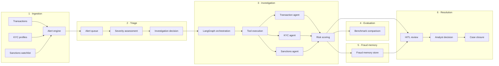
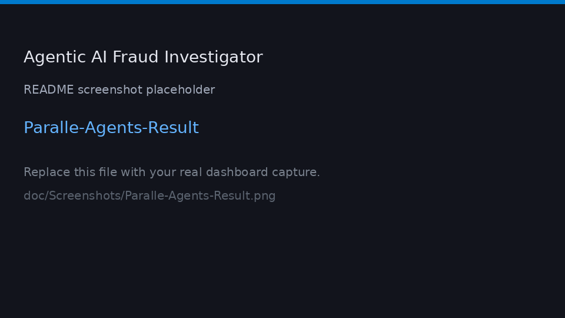
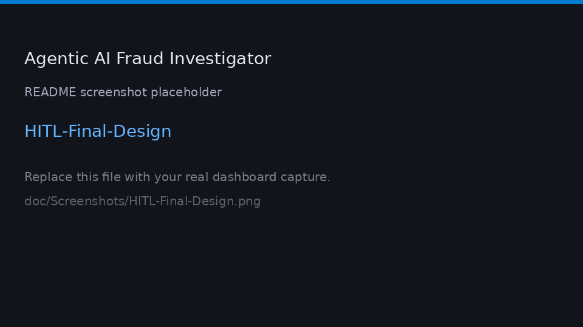
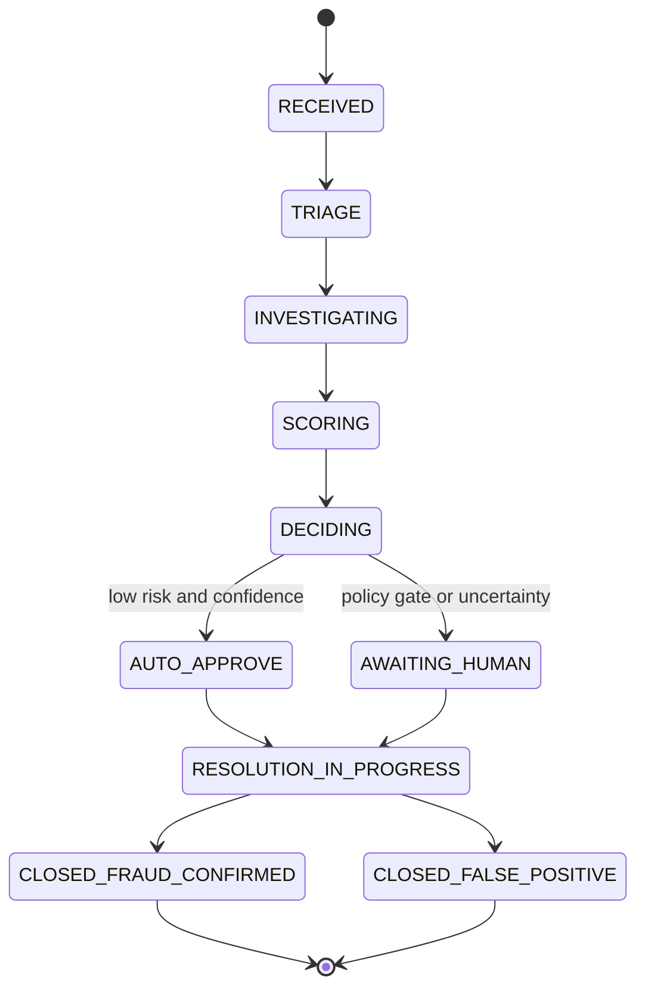

<p align="center">
  <a href="https://www.python.org/downloads/"></a>
  &nbsp;
  <a href="https://fastapi.tiangolo.com/"></a>
  &nbsp;
  <a href="https://langchain-ai.github.io/langgraph/"></a>
  &nbsp;
  <a href="https://streamlit.io/"></a>
  &nbsp;
  <a href="LICENSE"></a>
</p>

<p align="center"><strong>From fraud alert to autonomous investigation in under 4 minutes.</strong></p>

<p align="center"><em>Agentic AI Fraud Investigator</em> — a reference stack for digital banking and payments: ingest signals, triage with policy, orchestrate specialist agents, score risk with hybrid AI, gate on humans when it matters, and close the loop with auditable resolution.</p>

---

## Table of contents

- [At a glance](#at-a-glance)
- [Six-phase core workflow](#six-phase-core-workflow)
- [Alert reasons (deterministic triggers)](#alert-reasons-deterministic-triggers)
- [Architecture](#architecture)
- [Workflow summary](#workflow-summary)
- [LLM usage (three phases)](#llm-usage-three-phases)
- [Data model](#data-model)
- [Technical highlights](#technical-highlights)
- [Technology stack](#technology-stack)
- [Getting started](#getting-started)
- [Demo dashboard (steps 1–6)](#demo-dashboard-steps-16)
- [Testing and resilience](#testing-and-resilience)
- [API snapshot](#api-snapshot)
- [Hugging Face Spaces](#hugging-face-spaces)
- [Dashboard and screenshots](#dashboard-and-screenshots)
- [Risk scoring and policy routing](#risk-scoring-and-policy-routing)
- [Investigation lifecycle](#investigation-lifecycle)
- [Security](#security)
- [Repository layout](#repository-layout)
- [Roadmap and MVP status](#roadmap-and-mvp-status)
- [License and acknowledgements](#license-and-acknowledgements)

---

## At a glance

| Pillar | What you get |
| --- | --- |
| **Speed** | Deterministic triage and parallel agents keep latency low; LLMs add narrative and synthesis where they help most. |
| **Control** | Schema-validated intake, idempotency, policy thresholds, and explicit HITL before irreversible actions. |
| **Trust** | Investigation logs, audit trail, fraud memory, and explainable scoring so every decision can be tied to evidence. |

Synthetic demo data and a Streamlit **command center** are included for bootcamp demos, stakeholder walkthroughs, and integration tests — not as a drop-in production deployment.

---

## Six-phase core workflow

| Phase | Flow | Outcome |
| --- | --- | --- |
| **1 · Ingestion** | Transaction + KYC + Sanctions → **Alert engine** | Normalized, validated alerts linked to customers and signals. |
| **2 · Triage** | Alert queue → Severity assessment → Investigation decision | Auto-close low noise, P1/P2 prioritization, optional “initial suspicion” narrative. |
| **3 · Investigation** | Multi-agent orchestration **(LangGraph)** → **Tool execution** → **Risk scoring** | Parallel Transaction, KYC/device, and Sanctions agents; unified case picture for scoring. |
| **4 · Evaluation** | Agent results → **Benchmark comparison** | `POST /v1/evaluation/agent-result` compares runs to in-repo benchmark bands (risk, confidence, latency). |
| **5 · Fraud memory** | Fraud result → **Record fraud memory** for **RAG / context** | Enriches downstream triage and investigation with confirmed-fraud patterns (TTL in service code). |
| **6 · Resolution** | HITL review → Analyst decision → **Case closure** | Overrides, resolution actions, and compliance-oriented summaries on the audit path. |

---

## Alert reasons (deterministic triggers)

| Category | Example trigger | Role in demo stack |
| --- | --- | --- |
| **Transaction-based** | High-value transaction amount (**exceeds normal pattern** / velocity tier) | Drives amount-tier scoring and escalation. |
| **KYC-based** | **New or unrecognized device** login (possible account takeover) | Feeds KYC-device agent and triage factors. |
| **Sanctions-based** | **Transfer to a sanctioned country** (high-risk corridor) | Sanctions agent + country-risk metadata. |

Rules run **before** expensive LLM calls on the triage fast path; models enrich narrative and ambiguous cases.

---

## Architecture



---

## Workflow summary

| Step | Primary components | Key artifacts |
| --- | --- | --- |
| Ingest | `POST /v1/alerts`, `POST /v1/alerts/generate`, Pydantic models | `alerts`, validated payloads |
| Triage | `TriageService`, `/v1/triage/*` | `triage_assessments`, priority, investigation action |
| Investigate | LangGraph workflow, `/v1/investigation/*`, agents | `investigation_logs`, agent JSON, risk object |
| Evaluate | `/v1/evaluation/agent-result`, benchmark tables | Evaluation status, recommendations |
| Remember | Fraud memory service, `/v1/fraud-memory` | Patterns, frequency bumps, expiry metadata |
| Resolve | HITL routes, `ActionEngine`, audit APIs | `audit_trail`, executed actions, closure state |

---

## LLM usage (three phases)

| Phase | When | Role | Providers (configure in `.env`) | Primary code / routes |
| --- | --- | --- | --- | --- |
| **1 · Triage narrative** | After deterministic rules flag or route the alert | **`TriageService.assess`** path: human-readable **initial suspicion** note from raw metadata (plus short observations). | **`CEREBRAS_API_KEY`** + `CEREBRAS_MODEL` (fast JSON); **`GEMINI_API_KEY`** + `GEMINI_MODEL` (fallback) | [`app/llm/orchestration.py`](app/llm/orchestration.py) (`draft_triage_initial_suspicion`); [`app/services/triage_service.py`](app/services/triage_service.py); `POST /v1/triage/assess` |
| **2 · Investigation synthesis** | Post-escalation, once agents return | **Lead investigator**: synthesizes specialist outputs into a **case narrative** and structured risk JSON **before HITL**. | **`GEMINI_API_KEY`** (preferred deep JSON); **`CEREBRAS_API_KEY`** (fallback) | [`app/services/ai_reasoning_service.py`](app/services/ai_reasoning_service.py) (`InvestigationReasoningService`); [`app/llm/orchestration.py`](app/llm/orchestration.py); `POST /v1/investigation/customer-langgraph-deep` |
| **3 · Resolution audit** | After human decision (and optional action execution) | **Compliance summary**: resolution narrative for **audit trail**, combining analyst disposition with AI findings. | Same as phase 2 **or** dedicated audit model keys when you add them | [`app/api/hitl.py`](app/api/hitl.py) (`resolution_summary`, timeline); extend with dedicated prompts as you harden for production |

Unified HTTP routing: [`app/llm/client.py`](app/llm/client.py) (`call_fast_json` / `call_reasoning_json`). Optional **`ANTHROPIC_API_KEY`** in Docker Compose for future Claude-style wiring.

---

## Data model

| Table / artifact | Purpose |
| --- | --- |
| **transactions** | Raw movement of funds for analytics and agent input. |
| **kyc_profiles** | Identity and verification context (device/geo story in demos). |
| **sanctions_watchlist** | Reference rows and corridor metadata for screening. |
| **alerts** | The **trigger object** linking transaction, KYC, and sanctions context. |
| **triage_assessments** | Current triage verdict, scores, and narrative hooks. |
| **investigation_logs** | Step-by-step agent and orchestrator reasoning. |
| **fraud_memory** | Longer-lived patterns learned from confirmed or high-confidence fraud. |
| **audit_trail** | Human approvals, rejections, overrides, and resolution notes. |

Exact persistence varies by mode (in-memory demo queues vs. Postgres under `fullstack`); the **mental model** above matches how the API and dashboard are structured.

---

## Technical highlights

- **Idempotency** on alert intake plus **Pydantic v2 schema validation** so malformed or replayed requests fail fast and do not corrupt state.
- **Deterministic triage before AI**: auto-close low-value noise, P1/P2 prioritization, then LLMs for narrative and edge cases.
- **Hybrid risk scoring**: rule-based signals + LLM JSON (**0–100 style** scores and confidence in API payloads; internal engines may use **0–1** — see [Risk scoring and policy routing](#risk-scoring-and-policy-routing)).
- **Policy-based routing**: confidence and risk bands drive auto-approve vs. HITL (tune in `decision_engine`, graph scoring, and config).
- **Multi-agent orchestration (LangGraph)** with **parallel** evidence collection (Transaction, KYC/device, Sanctions) → aggregation → scoring.
- **Human-in-the-loop (HITL)** with analyst override: confirm fraud vs. false positive, notes, role-guarded routes.
- **Resolution actions** (demo [`ActionEngine`](app/services/action_engine.py)): freeze account, reverse transaction, block login, SMS notify, fraud-memory updates — swap in real coresystems adapters for production.
- **Full audit trail and explainability**: every material decision linkable to evidence, timelines, and investigation payloads.
- **Streamlit dashboard**: agent progress, risk gauges, **live polling** against the API for demo-grade UX.
- **Fraud memory TTL** on stored patterns ([`app/services/fraud_memory_service.py`](app/services/fraud_memory_service.py); extend toward **365-day** governance horizons as needed).
- **Stateful workflows** (LangGraph graph state; add `MemorySaver` / DB checkpointer when you graduate past demos).
- **Concurrency / resilience**: `asyncio` throughout, HTTP retries (e.g. Cerebras 429 backoff), outbound timeouts; optional **`asyncio.Semaphore(50)`** at integration boundaries under high fan-out.
- **Demo scenario — “The Midnight Mule”** 🌙: **$2,500** offshore transfer from a student profile → **P1** → composite risk **~92** → **HITL** → **confirm fraud** → resolution — target **under 4 minutes** on a warm laptop with keys configured.

---

## Technology stack

| Layer | Technology |
| --- | --- |
| Language | Python 3.11+ |
| API | FastAPI 0.111, Uvicorn, Pydantic v2 |
| Orchestration | LangGraph 0.1.5 |
| LLM access | Cerebras Cloud SDK, Google Generative AI (Gemini), httpx |
| Data | SQLAlchemy 2 (async), asyncpg / psycopg2 (fullstack profile) |
| Dashboard | Streamlit 1.35, Plotly |
| Observability | structlog |
| Tooling | uv (recommended), pytest |

---

## Getting started

### Prerequisites

- Python **3.11+**
- [uv](https://docs.astral.sh/uv/) (recommended)
- API keys: [Cerebras](https://console.cerebras.ai), [Google AI Studio](https://aistudio.google.com) (Gemini)

### Install

```bash
git clone https://github.com/habeneyasu/Agentic-AI-Fraud-Investigator.git
cd Agentic-AI-Fraud-Investigator

uv venv .venv --python 3.11
source .venv/bin/activate
uv pip install -e ".[test]"
```

### Configuration

Copy `.env.example` to `.env` and set at least:

```bash
CEREBRAS_API_KEY=your-cerebras-api-key
GEMINI_API_KEY=your-gemini-api-key
CEREBRAS_MODEL=llama3.1-70b
GEMINI_MODEL=gemini-1.5-flash
```

Use strong, non-default secrets in shared or internet-facing environments. Set `API_KEY` so clients must send `X-API-Key` when you expose the API beyond localhost.

### Run locally

```bash
# API
uv run uvicorn app.main:app --host 0.0.0.0 --port 8000 --reload

# Dashboard (separate terminal)
uv run streamlit run dashboard/streamlit_app.py --server.port 8501
```

- **OpenAPI:** http://localhost:8000/docs  
- **Dashboard:** http://localhost:8501  

### Docker Compose

The root **`Dockerfile`** exposes Streamlit on **8501** and runs FastAPI on `127.0.0.1:8000` inside the default **one-app** image (same shape as Hugging Face Docker Spaces).

```bash
docker compose up --build
```

Open **http://localhost:8501**. For Postgres + Redis + **API-only** on host **8000**:

```bash
docker compose --profile fullstack up -d
```

Set `SECRET_KEY`, `DATABASE_URL`, and `POSTGRES_*` in your environment or `.env` — defaults are not baked into Compose for secrets.

---

## Demo dashboard (steps 1–6)

Map the **Streamlit command center** to the six phases:

| Step | Phase | What to do |
| --- | --- | --- |
| **1** | Ingestion | Load or confirm **data sources** (transactions, KYC, sanctions). Use **Generate alerts** / `POST /v1/alerts/generate` so the queue is populated. |
| **2** | Triage | Open the **alert queue**, pick **CUST003** / Midnight Mule style rows, run **triage** and read severity + decision. |
| **3** | Investigation | Launch **parallel agents**; watch progress and intermediate JSON. |
| **4** | Evaluation | (Optional) Call **`POST /v1/evaluation/agent-result`** from `/docs` with agent payloads to see benchmark status. |
| **5** | Fraud memory | Inspect **fraud memory** patterns and stats; see how confirmed fraud reinforces future risk. |
| **6** | Resolution | Walk **HITL**: AI briefing, analyst override, **resolution actions**, then **audit trail** and metrics — close the case narrative. |

The UI also exposes additional substeps (metrics, timelines); treat the table above as the **story arc** for judges and peers.

---

## Testing and resilience

```bash
uv run pytest
uv run pytest --cov=app tests/
```

| Property | How the stack demonstrates it |
| --- | --- |
| **Idempotency** | Alert keys and investigation IDs designed for safe replays in demos; validate your own keys in production. |
| **Retries / backoff** | LLM HTTP clients retry on rate limits where implemented. |
| **Partial evidence** | Agents can complete with degraded confidence when a specialist times out — inspect synthesis JSON and dashboard messaging. |
| **Schema validation** | Pydantic rejects malformed intake early, before triage or graph work runs. |

Demo JSON under `app/data/` uses **May 2026** timestamps so recency logic behaves correctly. `runtime_alerts.json` ships empty; materialize alerts via the API or the dashboard.

---

## API snapshot

| Method | Path | Description |
| --- | --- | --- |
| `GET` | `/health` | Liveness |
| `POST` | `/v1/alerts` | Ingest alert |
| `POST` | `/v1/alerts/generate` | Generate alerts from policy + tables |
| `POST` | `/v1/triage/assess` | Triage + optional narrative |
| `POST` | `/v1/investigation/customer-langgraph-deep` | LangGraph + synthesis + HITL-oriented payload |
| `POST` | `/v1/evaluation/agent-result` | Benchmark an agent result |
| `POST` | `/api/hitl/{id}/decision` | Analyst decision |
| `GET` | `/audit/{id}` | Audit trail |
| `GET` / `POST` | `/v1/fraud-memory` | Read patterns/stats or mutate store |
| `GET` | `/docs` | Full OpenAPI |

Consolidated sanctions and fraud-memory shapes are documented inline in OpenAPI. Older scattered route names are folded into the pairs above.

---

## Hugging Face Spaces

Deploy as a **single Docker Space** with **`app_port: 8501`**.

1. [Create a Docker Space](https://huggingface.co/new-space) and connect this repository.  
2. Use the YAML card in [`deploy/SPACE_README_SNIPPET.md`](deploy/SPACE_README_SNIPPET.md) at the **top** of this README on the Space branch if required (`sdk: docker`, `app_port: 8501`).  
3. Add secrets: `GEMINI_API_KEY` / `GOOGLE_API_KEY`, `CEREBRAS_API_KEY`, optional `API_KEY`.

Full guide: [`deploy/HUGGINGFACE.md`](deploy/HUGGINGFACE.md).

---

## Dashboard and screenshots

The Streamlit app walks through **data → alerts → triage → agents → scoring → HITL → resolution → audit → metrics**, with **live polling**, **risk gauges**, and **progress** affordances for demos.

PNG assets live in **`doc/Screenshots/`** and are **committed** so GitHub can render README images on the default branch. The files below are **placeholder slides** (replace them with real captures when you have them; keep the same filenames so links stay valid).

| File | Use |
| --- | --- |
| `doc/Screenshots/AI-review-HITL.png` | AI review / HITL step |
| `doc/Screenshots/Deafult-live-page-1.png` | Live investigator / default view (variant 1) |
| `doc/Screenshots/Default-live-page-2.png` | Live investigator / default view (variant 2) |
| `doc/Screenshots/Final_Fraud_memory_and_audit.png` | Fraud memory + audit / resolution |
| `doc/Screenshots/HITL-Final-Design.png` | HITL layout and analyst flow |
| `doc/Screenshots/Paralle-Agents-Result.png` | Parallel agents results |
| `doc/Screenshots/Walk-thorugh-defalut-page.png` | Walkthrough default / command center |

**Example renders:**





---

## Risk scoring and policy routing

Deep investigation responses expose **pipeline risk** (rule-heavy / graph aggregate) and **final risk** (LLM synthesis). The dashboard emphasizes the **final** case score where present.

**Exemplar policy gates (tune in code and config):**

| Rule (illustrative) | Typical routing |
| --- | --- |
| `confidence < 0.6` | Route to **HITL** — model or aggregate uncertainty is too high to auto-act. |
| `risk > 70` (on 0–100 scale) | **HITL** or hard escalation — material harm if wrong. |
| `risk < 30` with adequate confidence | **Auto-approve** / auto-clear band for operational efficiency. |

Internal services sometimes use **normalized 0–1** scores; map consistently when binding to analyst UI and external ticketing.

---

## Investigation lifecycle

**State flow (text):**

```
RECEIVED → TRIAGE → INVESTIGATING → SCORING → DECIDING
                                                    │
                              ┌─────────────────────┤
                              ▼                     ▼
                        AUTO_APPROVE          AWAITING_HUMAN
                              │                     │
                              └──────────┬──────────┘
                                         ▼
                               RESOLUTION_IN_PROGRESS
                                         │
                    ┌────────────────────┤
                    ▼                    ▼
         CLOSED_FRAUD_CONFIRMED   CLOSED_FALSE_POSITIVE

Also: CLOSED_AUTO_CLEARED · CLOSED_LOW_RISK · PARTIAL_EVIDENCE · FAILED
```

**Same flow (Mermaid):**



> Other terminal states in code paths include **CLOSED_AUTO_CLEARED**, **CLOSED_LOW_RISK**, **PARTIAL_EVIDENCE**, and **FAILED**.

---

## Security

- When `API_KEY` is set, business routes expect matching **`X-API-Key`** (see `app/api/deps.py`). If unset, key checks are skipped for local demos only.  
- HITL and audit routes may expect **`X-User-Role`** (`Analyst` / `Auditor`) where enforced.  
- Request bodies validated with **Pydantic v2**.

Treat this repository as a **reference**: harden identity, network boundaries, and secrets before regulated production use.

---

## Repository layout

```
app/
├── api/                    # HTTP routes (alerts, triage, investigation, HITL, audit, evaluation, …)
├── core/                   # Configuration, logging, security
├── llm/                    # LLM clients, prompts, orchestration helpers
├── agents/                 # Evidence-oriented agents
├── graph/                  # LangGraph state, workflow, scoring
├── services/               # Domain services, triage, reasoning, action engine
├── data/                   # Demo JSON datasets
├── shared/                 # Shared models and enums
└── main.py                 # Application entrypoint

dashboard/
└── streamlit_app.py        # Guided demo UI

doc/
└── Screenshots/            # UI PNGs (linked above)

tests/
deploy/                     # Hugging Face snippet, K8s/App Runner *examples* (no live secrets)
docker-compose.yml          # default: one app (:8501); profile fullstack: API + Postgres + Redis
pyproject.toml
```

---

## Roadmap and MVP status

| Area | MVP (this repo) | Next steps |
| --- | --- | --- |
| Agents + LangGraph | Working parallel path + scoring | Richer tool nodes, external data vendors |
| HITL | Decision API + timelines + summaries | Full LLM-authored **resolution narrative** per bank template |
| Fraud memory | JSON / service with TTL | Enterprise store, **365-day** compliance retention, encryption |
| Evaluation | Benchmark API + static tables | Live model drift dashboards |
| Ops | Retries, timeouts, compose profiles | **Checkpointers**, **semaphores**, tracing, SLO dashboards |

---

## License and acknowledgements

**License:** MIT — see [`LICENSE`](LICENSE) in the repository root when published.

**Acknowledgements:** Built as a showcase-quality reference for **agentic fraud operations** — ideal for an **Andela AI Engineering Bootcamp** capstone narrative. Thanks to the teams behind **FastAPI**, **LangGraph**, **Streamlit**, **Cerebras**, and **Google Gemini** for the tools and APIs that make rapid iteration possible.
