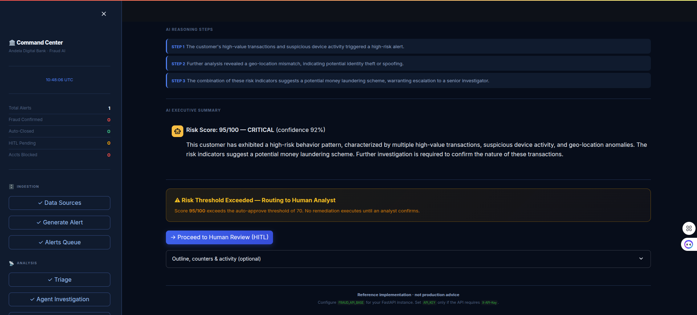
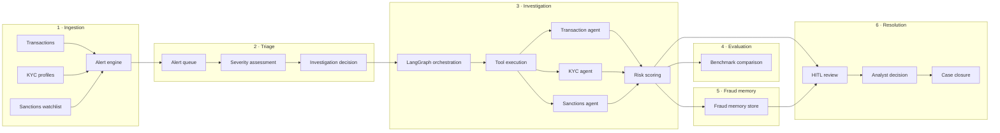
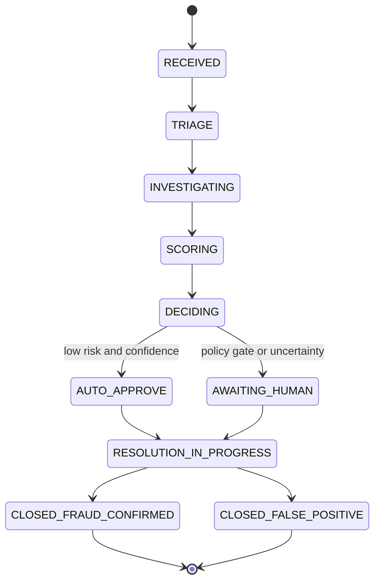

<p align="center">
  <a href="https://www.python.org/downloads/"></a>
  &nbsp;
  <a href="https://fastapi.tiangolo.com/"></a>
  &nbsp;
  <a href="https://langchain-ai.github.io/langgraph/"></a>
  &nbsp;
  <a href="https://streamlit.io/"></a>
  &nbsp;
  <a href="LICENSE"></a>
</p>

<p align="center"><strong>From fraud alert to autonomous investigation in under 4 minutes.</strong></p>

<p align="center"><em>Agentic AI Fraud Investigator</em> — a reference stack for digital banking and payments: ingest signals, triage with policy, orchestrate specialist agents, score risk with hybrid AI, gate on humans when it matters, and close the loop with auditable resolution.</p>

## UI preview

Committed captures from the Streamlit command center ([`doc/Screenshots/`](doc/Screenshots/)):




<details>
<summary><strong>Expand: if screenshots do not render</strong></summary>

- **Paths:** Filenames are **case-sensitive** — match files under `doc/Screenshots/`.
- **Git:** PNGs must be **committed** — `git status` / `git ls-files doc/Screenshots/`.
- **Local preview:** VS Code resolves `` relative to the repo root.
- **GitHub:** Images render for the **branch** you are viewing.

`uv run --with pillow python scripts/gen_screenshot_placeholders.py` regenerates **placeholder** slides for any missing files (replace with real UI captures when you can).

</details>

### Quick start

| Goal | Action |
| --- | --- |
| Run locally | [Install](#install) → [Configure](#configuration) → [Run locally](#run-locally) |
| Run in Docker | [`docker compose up --build`](#docker-compose) → open **http://localhost:8501** |
| Understand the flow | [Six-phase workflow](#six-phase-core-workflow) · [architecture](#architecture) |
| Try the UI | [UI preview](#ui-preview) · [Dashboard walkthrough](#dashboard-and-screenshots) |
| API / keys | [LLM usage](#llm-usage-three-phases) · [API snapshot](#api-snapshot) · [Security](#security) |

Jump: [table of contents](#table-of-contents).

---

## Table of contents

- [UI preview](#ui-preview)
- [At a glance](#at-a-glance)
- [Six-phase core workflow](#six-phase-core-workflow)
- [Alert reasons (deterministic triggers)](#alert-reasons-deterministic-triggers)
- [Architecture](#architecture)
- [LLM usage (three phases)](#llm-usage-three-phases)
- [Data model](#data-model)
- [Technical highlights](#technical-highlights)
- [Getting started](#getting-started)
- [Dashboard and screenshots](#dashboard-and-screenshots)
- [Testing and resilience](#testing-and-resilience)
- [API snapshot](#api-snapshot)
- [Hugging Face Spaces](#hugging-face-spaces)
- [Risk scoring and policy routing](#risk-scoring-and-policy-routing)
- [Investigation lifecycle](#investigation-lifecycle)
- [Security](#security)
- [Repository layout](#repository-layout)
- [Roadmap and MVP status](#roadmap-and-mvp-status)
- [License and acknowledgements](#license-and-acknowledgements)

---

## At a glance

| Pillar | What you get |
| --- | --- |
| **Speed** | Deterministic triage and parallel agents keep latency low; LLMs add narrative and synthesis where they help most. |
| **Control** | Schema-validated intake, idempotency, policy thresholds, and explicit HITL before irreversible actions. |
| **Trust** | Investigation logs, audit trail, fraud memory, and explainable scoring so every decision can be tied to evidence. |

Synthetic demo data and a Streamlit UI ship for demos and tests — not a production drop-in.

---

## Six-phase core workflow

| Phase | Flow → outcome | Main touchpoints |
| --- | --- | --- |
| **1 · Ingestion** | Tx + KYC + sanctions → alert engine → normalized alerts | `POST /v1/alerts`, `POST /v1/alerts/generate`, Pydantic models |
| **2 · Triage** | Queue → severity → investigate or close | `TriageService`, `/v1/triage/*` → `triage_assessments` |
| **3 · Investigation** | LangGraph + tools → parallel agents → risk object | LangGraph, `/v1/investigation/*`, `investigation_logs` |
| **4 · Evaluation** | Agent output → benchmark bands | `POST /v1/evaluation/agent-result` |
| **5 · Fraud memory** | Confirmed patterns → context for later cases | `/v1/fraud-memory`, TTL in [`fraud_memory_service.py`](app/services/fraud_memory_service.py) |
| **6 · Resolution** | HITL → analyst decision → closure | HITL routes, [`ActionEngine`](app/services/action_engine.py), audit APIs |

---

## Alert reasons (deterministic triggers)

| Category | Example trigger | Role in demo stack |
| --- | --- | --- |
| **Transaction-based** | High-value transaction amount (**exceeds normal pattern** / velocity tier) | Drives amount-tier scoring and escalation. |
| **KYC-based** | **New or unrecognized device** login (possible account takeover) | Feeds KYC-device agent and triage factors. |
| **Sanctions-based** | **Transfer to a sanctioned country** (high-risk corridor) | Sanctions agent + country-risk metadata. |

Rules run **before** expensive LLM calls on the triage fast path; models enrich narrative and ambiguous cases.

---

## Architecture



---

## LLM usage (three phases)

| Phase | When | Role | `.env` providers | Code |
| --- | --- | --- | --- | --- |
| **1 · Triage narrative** | After rules route the alert | Initial suspicion text from metadata | `CEREBRAS_*` (fast JSON), `GEMINI_*` (fallback) | [`orchestration.py`](app/llm/orchestration.py) `draft_triage_initial_suspicion`, [`triage_service.py`](app/services/triage_service.py), `POST /v1/triage/assess` |
| **2 · Investigation synthesis** | After agents return | Case narrative + risk JSON before HITL | `GEMINI_*` (preferred), `CEREBRAS_*` (fallback) | [`ai_reasoning_service.py`](app/services/ai_reasoning_service.py), [`orchestration.py`](app/llm/orchestration.py), `POST /v1/investigation/customer-langgraph-deep` |
| **3 · Resolution audit** | After analyst decision | Audit-oriented resolution summary | Same as 2 (or add dedicated audit keys later) | [`hitl.py`](app/api/hitl.py) |

HTTP helpers: [`app/llm/client.py`](app/llm/client.py) (`call_fast_json`, `call_reasoning_json`). Compose may define `ANTHROPIC_API_KEY` for future wiring.

---

## Data model

| Artifact | Role |
| --- | --- |
| **transactions** | Fund movements for analytics / agents |
| **kyc_profiles** | Identity + device/geo (demo story) |
| **sanctions_watchlist** | Screening reference + corridors |
| **alerts** | Trigger linking tx, KYC, sanctions |
| **triage_assessments** | Verdict, scores, narrative hooks |
| **investigation_logs** | Agent + orchestrator steps |
| **fraud_memory** | Confirmed-fraud patterns (TTL) |
| **audit_trail** | Human decisions, overrides, notes |

Persistence: in-memory demo queues vs Postgres when using the Compose **`fullstack`** profile.

---

## Technical highlights

Distinctive behaviors not spelled out elsewhere:

- **Idempotent alert intake** + **Pydantic v2** validation — bad or replayed requests fail before state changes.
- **Hybrid scores** — rules + LLM JSON; API-facing **0–100** vs internal **0–1** is called out under [Risk scoring](#risk-scoring-and-policy-routing).
- **Demo `ActionEngine`** — freeze / reverse / block / notify / fraud-memory hooks; replace with real core adapters for production.
- **Async + resilience** — `asyncio`, LLM client retries (e.g. Cerebras 429), timeouts; optional high-fan-out **`Semaphore`** at integration edges.
- **“Midnight Mule” demo** — **CUST003**, ~**$2,500** offshore, **P1**, risk **~92**, **HITL**, confirm fraud — **under 4 minutes** end-to-end with keys on a warm machine.

LangGraph state today is in-process; add a **DB checkpointer** when you outgrow demos.

---

## Getting started

### Prerequisites

- Python **3.11+**
- [uv](https://docs.astral.sh/uv/) (recommended)
- API keys: [Cerebras](https://console.cerebras.ai), [Google AI Studio](https://aistudio.google.com) (Gemini)
- Exact library pins: [`pyproject.toml`](pyproject.toml) (badges above are the headline versions)

### Install

```bash
git clone https://github.com/habeneyasu/Agentic-AI-Fraud-Investigator.git
cd Agentic-AI-Fraud-Investigator

uv venv .venv --python 3.11
source .venv/bin/activate
uv pip install -e ".[test]"
```

### Configuration

Copy `.env.example` to `.env` and set at least:

```bash
CEREBRAS_API_KEY=your-cerebras-api-key
GEMINI_API_KEY=your-gemini-api-key
CEREBRAS_MODEL=llama3.1-70b
GEMINI_MODEL=gemini-1.5-flash
```

Use strong, non-default secrets in shared or internet-facing environments. Set `API_KEY` so clients must send `X-API-Key` when you expose the API beyond localhost.

### Run locally

```bash
# API
uv run uvicorn app.main:app --host 0.0.0.0 --port 8000 --reload

# Dashboard (separate terminal)
uv run streamlit run dashboard/streamlit_app.py --server.port 8501
```

- **OpenAPI:** http://localhost:8000/docs  
- **Dashboard:** http://localhost:8501  

### Docker Compose

The root **`Dockerfile`** serves Streamlit on **8501** and FastAPI on `127.0.0.1:8000` in the default image (same layout as Hugging Face Docker Spaces).

```bash
docker compose up --build
```

Open **http://localhost:8501**. For Postgres + Redis + **API-only** on host **8000**:

```bash
docker compose --profile fullstack up -d
```

Set `SECRET_KEY`, `DATABASE_URL`, and `POSTGRES_*` in `.env` as needed.

---

## Dashboard and screenshots

Streamlit follows the [six-phase workflow](#six-phase-core-workflow): **Generate alerts** → triage (**CUST003** / Midnight Mule) → **parallel agents** → optional benchmarks via **`/docs`** → **HITL** through audit/metrics. Live polling and gauges are for demos, not production ops.

See **[UI preview](#ui-preview)** at the top of this README for the three primary embeds. Other committed PNGs in the same folder: `Deafult-live-page-1.png`, `Default-live-page-2.png`, `Final_Fraud_memory_and_audit.png`, `Walk-thorugh-defalut-page.png`.

---

## Testing and resilience

```bash
uv run pytest
uv run pytest --cov=app tests/
```

| Property | How the stack demonstrates it |
| --- | --- |
| **Idempotency** | Alert keys and investigation IDs designed for safe replays in demos; validate your own keys in production. |
| **Retries / backoff** | LLM HTTP clients retry on rate limits where implemented. |
| **Partial evidence** | Agents can complete with degraded confidence when a specialist times out — inspect synthesis JSON and dashboard messaging. |
| **Schema validation** | Pydantic rejects bad payloads before triage or the graph runs. |

`app/data/` demo JSON uses **May 2026** timestamps. `runtime_alerts.json` starts empty — generate alerts from the UI or API.

---

## API snapshot

| Method | Path | Description |
| --- | --- | --- |
| `GET` | `/health` | Liveness |
| `POST` | `/v1/alerts` | Ingest alert |
| `POST` | `/v1/alerts/generate` | Generate alerts from policy + tables |
| `POST` | `/v1/triage/assess` | Triage + optional narrative |
| `POST` | `/v1/investigation/customer-langgraph-deep` | LangGraph + synthesis + HITL-oriented payload |
| `POST` | `/v1/evaluation/agent-result` | Benchmark an agent result |
| `POST` | `/api/hitl/{id}/decision` | Analyst decision |
| `GET` | `/audit/{id}` | Audit trail |
| `GET` / `POST` | `/v1/fraud-memory` | Read patterns/stats or mutate store |
| `GET` | `/docs` | OpenAPI (full surface; sanctions / fraud-memory shapes live there) |

---

## Hugging Face Spaces

Deploy as a **single Docker Space** with **`app_port: 8501`**. Full walkthrough: [`deploy/HUGGINGFACE.md`](deploy/HUGGINGFACE.md).

<details>
<summary><strong>Expand: Docker Space setup (checklist)</strong></summary>

**Important:** create the Space with the **Docker** SDK, not **Streamlit**. If you see Hugging Face’s default **“Welcome to Streamlit”** page (spiral demo, “Edit `/streamlit_app.py`”), the Space is not running this repo’s image — recreate it as Docker and link the correct branch (`main` recommended).

1. [Create a Docker Space](https://huggingface.co/new-space) and connect this repository.
2. In Space **Settings → Repository**, set the GitHub branch to **`main`** (recommended). Root `README.md` on **`main`** already starts with the required **YAML front matter** (`sdk: docker`, `app_port: 8501`, `startup_duration_timeout`). To tweak card text or timeouts, edit the top of this file or copy from [`deploy/SPACE_README_SNIPPET.md`](deploy/SPACE_README_SNIPPET.md).
3. Optional: use branch **`hf-space`** instead if you prefer a dedicated deploy branch (kept in sync with `main`; same YAML + README body).
4. Add Space **Secrets**: `GEMINI_API_KEY` / `GOOGLE_API_KEY`, `CEREBRAS_API_KEY`, optional `API_KEY`.

</details>

---

## Risk scoring and policy routing

Investigation payloads can include **pipeline risk** (rules/graph) and **final risk** (LLM synthesis); the UI prefers **final** when present. Some services use **0–1** internally — keep mapping consistent to **0–100** in analyst-facing views.

| Rule (illustrative) | Typical routing |
| --- | --- |
| `confidence < 0.6` | **HITL** — uncertainty too high to auto-act |
| `risk > 70` (0–100) | **HITL** / escalation |
| `risk < 30` with solid confidence | **Auto-approve** / auto-clear band |

Tune gates in `decision_engine`, graph scoring, and config.

---

## Investigation lifecycle



> Also used in code: **CLOSED_AUTO_CLEARED**, **CLOSED_LOW_RISK**, **PARTIAL_EVIDENCE**, **FAILED**.

---

## Security

- Optional **`API_KEY`** → clients send **`X-API-Key`** (`app/api/deps.py`). Omitted = local demo only.
- Some HITL/audit routes use **`X-User-Role`** (`Analyst` / `Auditor`).
- **Pydantic v2** on request bodies.

Reference implementation only — add identity, network controls, and secret handling before regulated production.

---

## Repository layout

```
app/
├── api/                    # HTTP routes (alerts, triage, investigation, HITL, audit, evaluation, …)
├── core/                   # Configuration, logging, security
├── llm/                    # LLM clients, prompts, orchestration helpers
├── agents/                 # Evidence-oriented agents
├── graph/                  # LangGraph state, workflow, scoring
├── services/               # Domain services, triage, reasoning, action engine
├── data/                   # Demo JSON datasets
├── shared/                 # Shared models and enums
└── main.py                 # Application entrypoint

dashboard/
└── streamlit_app.py        # Guided demo UI (canonical)

streamlit_app.py            # Optional root entry → delegates to dashboard/ (HF / misconfigured runners)

doc/
└── Screenshots/            # UI PNGs (linked above)

tests/
deploy/                     # HF deploy guide, K8s/App Runner examples (no live secrets)
docker-compose.yml          # default: one app (:8501); profile fullstack: API + Postgres + Redis
pyproject.toml
```

---

## Roadmap and MVP status

| Area | MVP (this repo) | Next steps |
| --- | --- | --- |
| Agents + LangGraph | Working parallel path + scoring | Richer tool nodes, external data vendors |
| HITL | Decision API + timelines + summaries | Full LLM-authored **resolution narrative** per bank template |
| Fraud memory | JSON / service with TTL | Enterprise store, **365-day** compliance retention, encryption |
| Evaluation | Benchmark API + static tables | Live model drift dashboards |
| Ops | Retries, timeouts, compose profiles | **Checkpointers**, **semaphores**, tracing, SLO dashboards |

---

## License and acknowledgements

**License:** MIT — [`LICENSE`](LICENSE).

Showcase reference for agentic fraud ops (e.g. capstone / bootcamp demos). Thanks to **FastAPI**, **LangGraph**, **Streamlit**, **Cerebras**, and **Google Gemini** communities.
